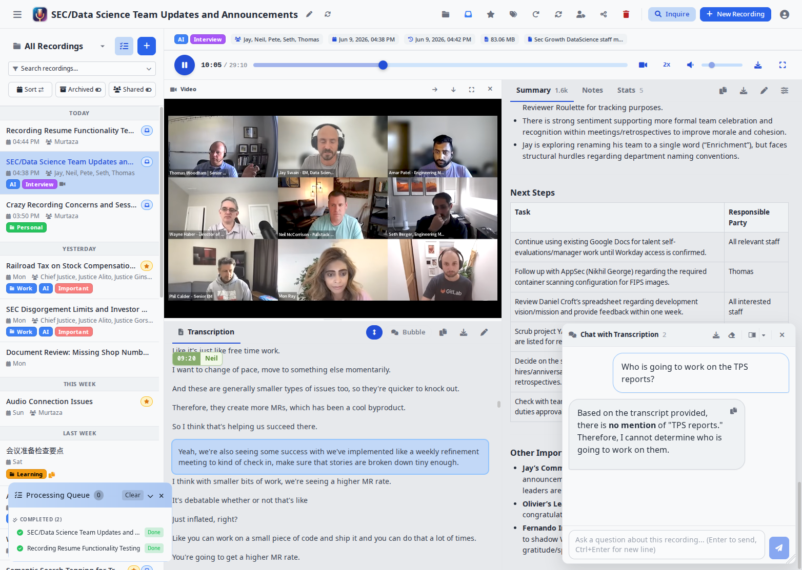
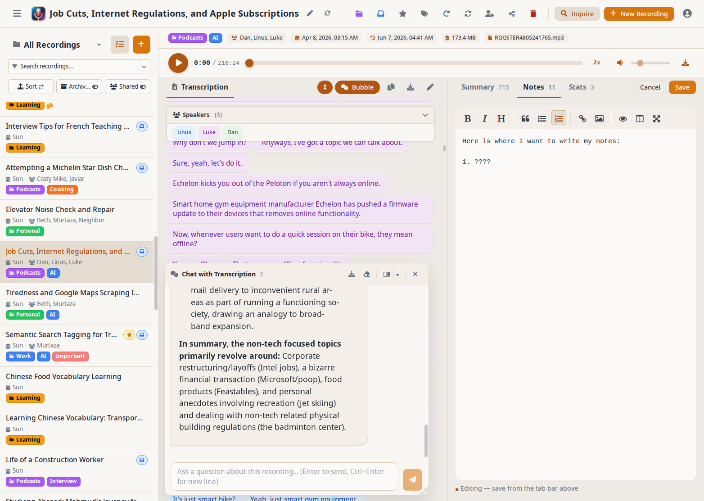
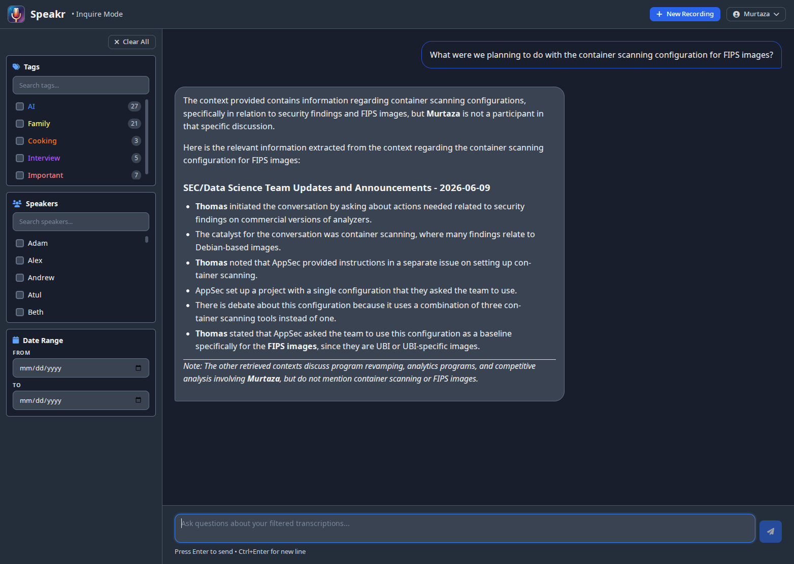
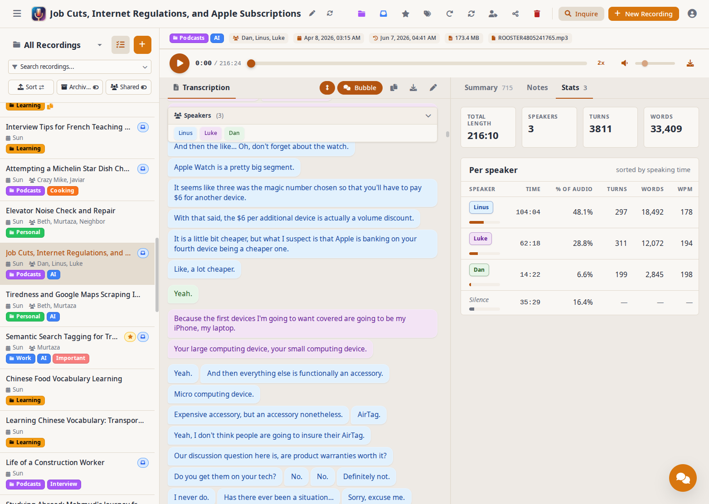
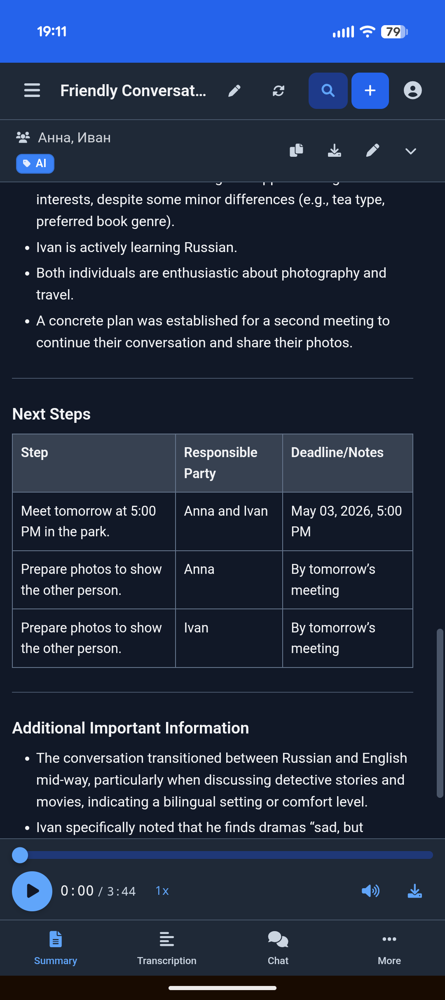
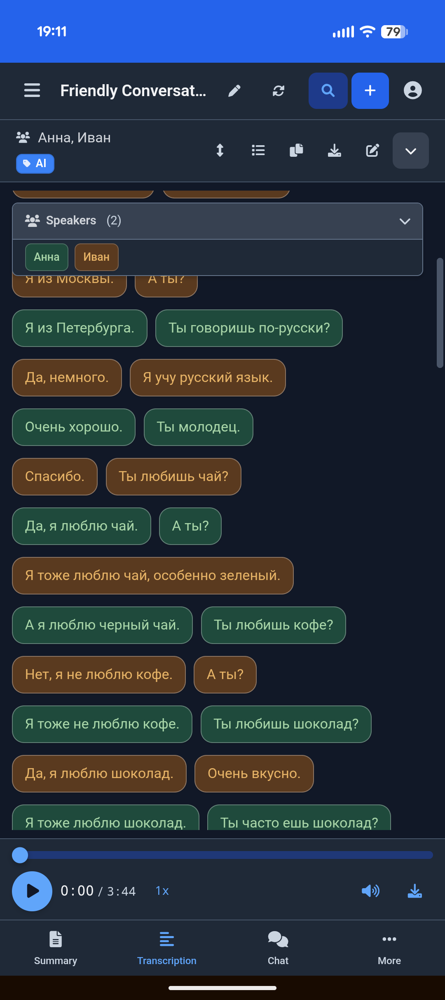

<div align="center">
    
</div>

<h1 align="center">PXE MeetingMitra</h1>
<p align="center">Self-hosted AI transcription and intelligent note-taking platform</p>

<p align="center">
  <a href="https://www.gnu.org/licenses/agpl-3.0"></a>
  <a href="https://github.com/murtaza-nasir/speakr/actions/workflows/docker-publish.yml"></a>
  <a href="https://hub.docker.com/r/learnedmachine/speakr"></a>
  <a href="https://github.com/murtaza-nasir/speakr/releases/latest"></a>
</p>

<p align="center">
  <a href="https://murtaza-nasir.github.io/speakr">Documentation</a> •
  <a href="https://murtaza-nasir.github.io/speakr/getting-started">Quick Start</a> •
  <a href="https://murtaza-nasir.github.io/speakr/screenshots">Screenshots</a> •
  <a href="https://hub.docker.com/r/learnedmachine/speakr">Docker Hub</a> •
  <a href="https://github.com/murtaza-nasir/speakr/releases">Releases</a>
</p>

---

## Overview

PXE MeetingMitra transforms your audio recordings into organized, searchable, and intelligent notes. Built for privacy-conscious groups and individuals, it runs entirely on your own infrastructure, ensuring your sensitive conversations remain completely private.

<div align="center">
    
</div>

## Key Features

PXE MeetingMitra turns a recording into organized, searchable, shareable knowledge. Here is the pipeline:

### Capture
- **Flexible input** - record from your microphone, your computer's system or browser-tab audio, or both mixed together; or drag and drop existing files. A per-OS setup guide and a virtual-device picker surface Pulse / PipeWire monitors, BlackHole, VB-Cable, Voicemeeter, and Stereo Mix as inputs.
- **Long sessions** - in-app recordings stream to the server during capture, so sessions can run for hours and survive a page reload.
- **Hands-off intake** - a watched "black hole" folder auto-imports and processes any audio dropped into it.

### Transcribe
- **Bring your own engine** - self-hosted WhisperX (recommended; it is what enables the speaker features below), OpenAI, Mistral / Voxtral, or any custom ASR webservice. The right connector is auto-detected from your configuration.
- **Speaker diarization** - automatic who-said-what labeling (WhisperX, or OpenAI's diarizing models).
- **Voice profiles** - recognize the same person across different recordings via voice embeddings (requires the WhisperX ASR backend).
- **Custom vocabulary and hotwords** (most effective with the WhisperX backend) - bias the transcriber toward names, jargon, and acronyms it would otherwise mishear; configurable globally or per tag / folder.
- **Synced playback** - click any line to jump to that moment, follow-along highlighting during playback, and a chat-style bubble view.
- **Language support** - automatic language detection plus a quick-pick of 11 common languages.

### Understand
- **Summaries** - generated automatically, with prompts you can fully customize per recording, tag, or folder (including reusable prompt variables).
- **Event extraction** - surface action items and calendar-worthy events from a transcript.
- **Per-recording chat** - ask questions about a single recording in a floating, dockable panel.
- **Inquire Mode** - semantic search and natural-language chat across your entire library at once.

### Organize
- **Folders and bulk operations** to keep a large library tidy.
- **Smart tags** that carry their own AI prompt and ASR settings - and stack, so multiple tags layer their instructions.
- **Retention policies** with auto-deletion and per-recording protection from cleanup.
- **Automated export** to templated files when a recording finishes.

### Collaborate
- **Multi-user** with **Single Sign-On** against any OIDC provider (Keycloak, Azure AD, Google, Auth0, Pocket ID).
- **Groups** with group-scoped tags that auto-share recordings to every member.
- **Granular internal sharing** (view / edit / reshare) and admin-controlled, secure **public links**.

### Automate
- **REST API v1** with a Swagger UI, for automation tools (n8n, Zapier, Make) and dashboards.
- **Signed webhooks** - HMAC-signed, SSRF-guarded, retrying outbound notifications on recording lifecycle events.
- **Usage budgets** for LLM tokens and transcription minutes, per user.

PXE MeetingMitra is also an installable Progressive Web App - mobile-first, offline-capable, with a phone share-target - and ships light/dark themes, an incognito mode, and a UI translated into seven languages.

## Real-World Use Cases

Different people use PXE MeetingMitra's collaboration and retention features in different ways:

| Use Case | Setup | What It Does |
|----------|-------|-------------|
| **Family memories** | Create "Family" group with protected tag | Everyone gets access to trips and events automatically, recordings preserved forever |
| **Book club discussions** | "Book Club" group, tag monthly meetings | All members auto-share discussions, can add personal notes about what resonated |
| **Work project group** | Share individually with 3 teammates | Temporary collaboration, easy to revoke when project ends |
| **Daily group standups** | Group tag with 14-day retention | Auto-share with group, auto-cleanup of routine meetings |
| **Architecture decisions** | Engineering group tag, protected from deletion | Technical discussions automatically shared, preserved permanently as reference |
| **Client consultations** | Individual share with view-only permission | Controlled external access, clients can't accidentally edit |
| **Research interviews** | Protected tag + Obsidian export | Preserve recordings indefinitely, transcripts auto-import to note-taking system |
| **Legal consultations** | Group tag with 7-year retention | Automatic sharing with legal group, compliance-based retention |
| **Sales calls** | Group tag with 1-year retention | Whole sales group learns from each call, cleanup after sales cycle |

### Creative Tag Prompt Examples

Tags with custom prompts transform raw recordings into exactly what you need:

- **Recipe recordings**: Record yourself cooking while narrating - tag with "Recipe" to convert messy speech into formatted recipes with ingredient lists and numbered steps
- **Lecture notes**: Students tag lectures with "Study Notes" to get organized outlines with concepts, examples, and definitions instead of raw transcripts
- **Code reviews**: "Code Review" tag extracts issues, suggested changes, and action items in technical language developers can use directly
- **Meeting summaries**: "Action Items" tag ignores discussion and returns just decisions, tasks, and deadlines

### Tag Stacking for Combined Effects

Stack multiple tags to layer instructions:
- "Recipe" + "Gluten Free" = Formatted recipe with gluten substitution suggestions
- "Lecture" + "Biology 301" = Study notes format focused on biological terminology
- "Client Meeting" + "Legal Review" = Client requirements plus legal implications highlighted

The order can matter - start with format tags, then add focus tags for best results.

### Integration Examples

- **Obsidian/Logseq**: Enable auto-export to write completed transcripts directly to your vault using your custom template - no manual export needed
- **Documentation wikis**: Map auto-export to your wiki's import folder for seamless transcript publishing
- **Content creation**: Create SRT subtitle templates from your audio recordings for podcasts or video content
- **Project management**: Extract action items with custom tag prompts, then auto-export for automated task creation

## Quick Start

### Using Docker (Recommended)

```bash
# Create project directory
mkdir speakr && cd speakr

# Download docker-compose configuration:
wget https://raw.githubusercontent.com/murtaza-nasir/speakr/master/config/docker-compose.example.yml -O docker-compose.yml

# Download the environment template:
wget https://raw.githubusercontent.com/murtaza-nasir/speakr/master/config/env.transcription.example -O .env

# Configure your API keys and launch
nano .env
docker compose up -d

# Access at http://localhost:8899
```

> **Lightweight image:** Use `learnedmachine/speakr:lite` for a smaller image (~725MB vs ~4.4GB) that skips PyTorch. All features work normally — only Inquire Mode's semantic search falls back to basic text search.

**Required API Keys:**
- `TRANSCRIPTION_API_KEY` - For speech-to-text (OpenAI) or `ASR_BASE_URL` for self-hosted
- `TEXT_MODEL_API_KEY` - For summaries, titles, and chat (OpenRouter or OpenAI)

### Transcription Options

PXE MeetingMitra uses a **connector-based architecture** that auto-detects your transcription provider:

| Option | Setup | Speaker Diarization | Voice Profiles |
|--------|-------|---------------------|----------------|
| **OpenAI Transcribe** | Just API key | Yes (`gpt-4o-transcribe-diarize`) | No |
| **WhisperX ASR** | GPU container | Yes (best quality) | Yes |
| **Mistral Voxtral** | Just API key | Yes (built-in) | No |
| **VibeVoice ASR** | Self-hosted (vLLM) | Yes (built-in) | No |
| **Legacy Whisper** | Just API key | No | No |

**Simplest setup (OpenAI with diarization):**
```bash
TRANSCRIPTION_API_KEY=sk-your-openai-key
TRANSCRIPTION_MODEL=gpt-4o-transcribe-diarize
```

**Best quality (Self-hosted WhisperX):**
```bash
ASR_BASE_URL=http://whisperx-asr:9000
ASR_RETURN_SPEAKER_EMBEDDINGS=true  # Enable voice profiles
```
Requires [WhisperX ASR Service](https://github.com/murtaza-nasir/whisperx-asr-service) container with GPU.

**Mistral Voxtral (cloud diarization):**
```bash
TRANSCRIPTION_CONNECTOR=mistral
TRANSCRIPTION_API_KEY=your-mistral-key
TRANSCRIPTION_MODEL=voxtral-mini-latest
```

**VibeVoice ASR (self-hosted, no cloud dependency):**
```bash
TRANSCRIPTION_CONNECTOR=vibevoice
TRANSCRIPTION_BASE_URL=http://your-vllm-server:8000
TRANSCRIPTION_MODEL=vibevoice
```
Requires [VibeVoice](https://huggingface.co/microsoft/VibeVoice-ASR) served via vLLM with GPU.

> **PyTorch 2.6 Users:** If you encounter a "Weights only load failed" error with WhisperX, add `TORCH_FORCE_NO_WEIGHTS_ONLY_LOAD=true` to your ASR container. See [troubleshooting](https://murtaza-nasir.github.io/speakr/troubleshooting#pytorch-26-weights-loading-error-whisperx-asr-service) for details.

**[View Full Installation Guide →](https://murtaza-nasir.github.io/speakr/getting-started/installation)**

## Documentation

Complete documentation is available at **[murtaza-nasir.github.io/speakr](https://murtaza-nasir.github.io/speakr)**

- [Getting Started](https://murtaza-nasir.github.io/speakr/getting-started) - Quick setup guide
- [User Guide](https://murtaza-nasir.github.io/speakr/user-guide/) - Learn all features
- [Admin Guide](https://murtaza-nasir.github.io/speakr/admin-guide/) - Administration and configuration
- [Troubleshooting](https://murtaza-nasir.github.io/speakr/troubleshooting) - Common issues and solutions
- [FAQ](https://murtaza-nasir.github.io/speakr/faq) - Frequently asked questions

## Latest Release (v0.9.3-alpha)

**Security patch: updates bundled FFmpeg to fix CVE-2026-8461.** PXE MeetingMitra runs FFmpeg/ffprobe on uploaded media, and the previously bundled build (johnvansickle static 7.0.2) carried a MagicYUV decoder flaw ("PixelSmash") that a crafted file could use for a crash or remote code execution. FFmpeg now comes from the maintained BtbN builds, pinned to the 8.1 branch (8.1.2, which contains the fix). Recommended for all deployments, especially multi-user instances that accept untrusted uploads. **Full release notes: [`release_notes_v0.9.3.md`](release_notes_v0.9.3.md).**

### v0.9.2-alpha (previous release)

**Adds a pluggable local / S3 storage backend.** Recording audio can now live in S3-compatible object storage (AWS S3, MinIO, Backblaze B2, Cloudflare R2, Wasabi) instead of, or alongside, the local filesystem, with presigned-URL delivery and a migration script for existing recordings. Local storage stays the default, so existing deployments are unaffected until they opt in. Contributed by @Daabramov (#268). **Full release notes: [`release_notes_v0.9.2.md`](release_notes_v0.9.2.md).**

### v0.9.1-alpha (previous release)

**A patch release hardening the v0.9.0 upload path.** Fixes uploads failing with an expired CSRF token after long sessions or sleep (#310), Inquire embeddings not being generated when auto-summarization is enabled (#305), and the Account page's API token modals not opening (#308); adds a timeout so stalled uploads fail into the recovery path and a warning before leaving the page mid-upload. **Full release notes: [`release_notes_v0.9.1.md`](release_notes_v0.9.1.md).**

### v0.9.0-alpha highlights (the major feature release this patches)

**The first non-patch release in the v0.8 line.** Three big user-facing themes: capturing audio is now multi-platform and properly documented, the mobile app is a first-class member of the design system, and the upload modal stops feeling like a desktop card pasted onto a phone. **Full release notes: [`release_notes_v0.9.0.md`](release_notes_v0.9.0.md).**

**System Audio & Multi-Input Recording**
- Per-OS help guide auto-opens for the right platform (macOS BlackHole + Multi-Output Device, Windows "Share system audio", Linux pavucontrol + `pactl module-virtual-source` one-liner)
- New Input devices picker: pick a primary mic AND an optional "Also mix in" secondary device; Web Audio mixes both into one track for capturing both sides of a meeting
- Toggle to disable Chrome's echo cancellation / noise suppression / auto-gain (needed for monitor-source capture)
- Virtual audio device discovery (BlackHole, Loopback, VB-Cable, Voicemeeter, Stereo Mix, Pulse / PipeWire monitors)
- Privacy notes section flags the trade-offs honestly with concrete mitigations

**Stats Tab**
- New per-recording tab: total length, speaker count, turns, words at the top; per-speaker time / % / turns / words / WPM table; silence row
- Available on desktop right-rail tabs and mobile bottom-nav More overflow

**Upload Modal Redesign**
- Real modal overlay (not full-screen takeover), progressive disclosure of Options behind a chip summary, inline file preview with duration probe, sticky modal-footer Upload action, last-used tag/folder/language auto-restore with clearable chips, calmer recording buttons
- Mobile: full-width bottom-sheet with drag-to-dismiss

**Mobile UI**
- Bottom navigation (Summary / Transcript / Chat / More), contextual icons in the chevron row, edge-to-edge content, sticky speaker pills, sticky editor Cancel/Save footer, audio player polish (volume slider rotation fix, popover anchored upward), progress queue as a bottom sheet anchored above the player

**Inquire mode** "+ New Recording" now opens the upload modal directly via `?upload=1` instead of dumping you on the list.

**Design system unification** brought 22 modals onto shared `.modal-*` primitives, `.btn` + `.field` everywhere, dark-mode select theming, header consolidation, sidebar redesign, floating dockable chat panel.

**Backend & infra**: Webhooks Phase 1–3 with HMAC + retry + SSRF guard, server-side recording sessions (hours-long ceiling, resume-on-reload), IDOR fixes for folder / tag ownership, eager-loading and batch query performance work.

**Localization** refreshed across en, fr, de, es, ru, zh, pt-BR.

---

**Older releases:** see the [GitHub Releases page](https://github.com/murtaza-nasir/speakr/releases) for tagged versions, or the [release history on the docs site](https://murtaza-nasir.github.io/speakr/#latest-updates) for narrative changelog entries going back to earlier v0.x lines.

## Screenshots

<table align="center" border="0">
  <tr>
    <td align="center">
      
      <br><em>Main view with floating chat and notes</em>
    </td>
    <td align="center">
      
      <br><em>Video playback synced to the transcript</em>
    </td>
  </tr>
  <tr>
    <td align="center">
      
      <br><em>Ask questions across all your recordings</em>
    </td>
    <td align="center">
      
      <br><em>Per-recording stats and speaker breakdown</em>
    </td>
  </tr>
  <tr>
    <td align="center">
      
      <br><em>On mobile: summary with bottom navigation</em>
    </td>
    <td align="center">
      
      <br><em>On mobile: transcript in bubble view</em>
    </td>
  </tr>
</table>

**[View Full Screenshot Gallery →](https://murtaza-nasir.github.io/speakr/screenshots)**

## Technology Stack

- **Backend**: Python/Flask with SQLAlchemy
- **Frontend**: Vue.js 3 with Tailwind CSS
- **AI/ML**: OpenAI Whisper, OpenRouter, Ollama support
- **Database**: SQLite (default) or PostgreSQL
- **Deployment**: Docker, Docker Compose

## Roadmap

### Completed
- Speaker voice profiles with AI-powered identification (v0.5.9)
- Group workspaces with shared recordings (v0.5.9)
- PWA enhancements with offline support and background sync (v0.5.10)
- Multi-user job queue with fair scheduling (v0.6.0)
- SSO integration with OIDC providers (v0.7.0)
- Token usage tracking and per-user budgets (v0.7.2)
- Connector-based transcription architecture with auto-detection (v0.8.0)
- Comprehensive REST API with Swagger UI documentation (v0.8.0)
- Video retention with in-browser video playback (v0.8.11)
- Parallel uploads with duplicate detection (v0.8.11)
- Fullscreen video mode with live subtitles (v0.8.14)
- Custom vocabulary and transcription hints (v0.8.14)

### Near-term
- Quick language switching for transcription
- Automated workflow triggers

### Long-term
- Plugin system for custom integrations
- End-to-end encryption option

### Reporting Issues

- [Report bugs](https://github.com/murtaza-nasir/speakr/issues)
- [Request features](https://github.com/murtaza-nasir/speakr/discussions)

## License

This project is **dual-licensed**:

1.  **GNU Affero General Public License v3.0 (AGPLv3)**
    [](https://www.gnu.org/licenses/agpl-3.0)

    PXE MeetingMitra is offered under the AGPLv3 as its open-source license. You are free to use, modify, and distribute this software under the terms of the AGPLv3. A key condition of the AGPLv3 is that if you run a modified version on a network server and provide access to it for others, you must also make the source code of your modified version available to those users under the AGPLv3.

    * You **must** create a file named `LICENSE` (or `COPYING`) in the root of your repository and paste the full text of the [GNU AGPLv3 license](https://www.gnu.org/licenses/agpl-3.0.txt) into it.
    * Read the full license text carefully to understand your rights and obligations.

2.  **Commercial License**

    For users or organizations who cannot or do not wish to comply with the terms of the AGPLv3 (for example, if you want to integrate PXE MeetingMitra into a proprietary commercial product or service without being obligated to share your modifications under AGPLv3), a separate commercial license is available.

    Please contact **PXE MeetingMitra maintainers** for details on obtaining a commercial license.

**You must choose one of these licenses** under which to use, modify, or distribute this software. If you are using or distributing the software without a commercial license agreement, you must adhere to the terms of the AGPLv3.

## Contributing

We welcome contributions to PXE MeetingMitra! There are many ways to help:

- **Bug Reports & Feature Requests**: [Open an issue](https://github.com/murtaza-nasir/speakr/issues)
- **Discussions**: [Share ideas and ask questions](https://github.com/murtaza-nasir/speakr/discussions)
- **Documentation**: Help improve our docs
- **Translations**: Contribute translations for internationalization

### Code Contributions

By submitting a pull request, you agree to our [Contributor License Agreement (CLA)](CLA.md). This ensures we can maintain our dual-license model (AGPLv3 and Commercial). You retain copyright ownership of your contribution — the CLA simply grants us permission to include it in both the open source and commercial versions of PXE MeetingMitra. Our bot will post a reminder when you open a PR.

**See our [Contributing Guide](CONTRIBUTING.md) for complete details on:**
- How the CLA works and why we need it
- Step-by-step contribution process
- Development setup instructions
- Coding standards and best practices
