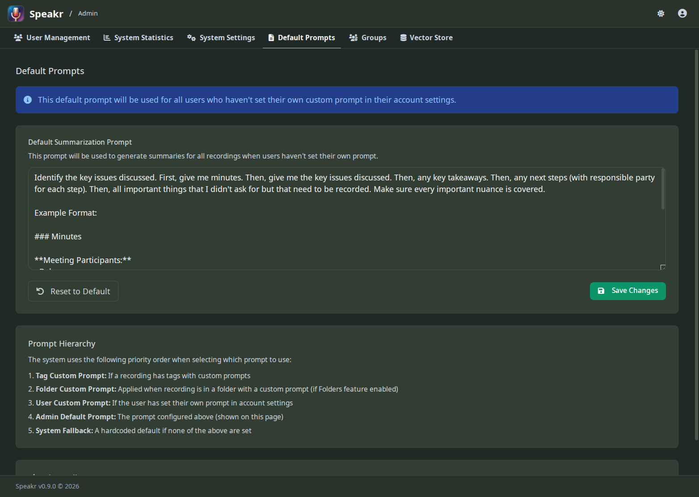

# Default Prompts

The Default Prompts tab lets you shape how AI interprets and [summarizes recordings](../features.md#automatic-summarization) across your entire PXE MeetingMitra instance. This is where you establish the baseline intelligence that users experience when they haven't customized their own [personal prompts](../user-guide/settings.md#custom-prompts-tab).

## Understanding Prompt Hierarchy

PXE MeetingMitra uses a sophisticated hierarchy to determine which prompt to use for any given recording. This system provides flexibility while maintaining control, ensuring users get appropriate summaries while allowing customization where needed.

At the top of the hierarchy are tag-specific prompts. When a recording has [tags](../user-guide/settings.md#tag-management-tab) with associated prompts, these take absolute priority. Learn about [tag management](../features.md#tagging-system) in the features guide. Multiple tag prompts concatenate intelligently, allowing sophisticated prompt stacking for specialized content types.

Next comes the user's personal custom prompt, set in their [account settings](../user-guide/settings.md#custom-prompts-tab). Users can also configure [language preferences](../user-guide/settings.md#language-preferences) for their summaries. This allows individuals to tailor summaries to their specific needs without affecting others. Many users never set this, making your admin default even more important.

Your admin default prompt, configured on this page, serves as the foundation for most summaries. This is what new users experience and what long-term users rely on when they haven't customized their settings. It shapes the overall intelligence and utility of your PXE MeetingMitra instance.

Finally, if all else fails, a hardcoded system fallback ensures summaries are always generated. You'll rarely see this in practice, but it provides a safety net ensuring the system never fails to produce output.

## Crafting Effective Default Prompts

Your default prompt is more than technical instruction - it's a template for understanding. The prompt shown in the interface demonstrates a balanced approach, requesting key issues, decisions, and action items. This structure works well for business meetings but might not suit all contexts.

Consider your user base when designing prompts. A research institution might emphasize methodologies and findings. A legal firm could focus on case details and precedents. For multi-language support, see [language configuration](../features.md#language-support) and [troubleshooting language issues](../troubleshooting.md#summary-language-doesnt-match-preference). A creative agency might highlight concepts and client feedback. The prompt should reflect what matters most to your users.

The AI responds best to clear, structured requests. Use bullet points or numbered sections to organize the output. Specify the level of detail you want - "brief overview" versus "comprehensive analysis" produces very different results. Include examples if certain formats are crucial.

Remember that this prompt applies to everything from five-minute check-ins to two-hour workshops. Design for versatility. Avoid overly specific requirements that might not apply to all content. Focus on extracting universally valuable information while allowing the AI flexibility to adapt to different recording types.

## The Default Prompt Editor

The large text area displays your current default prompt, with full markdown support for formatting. You can use bold for emphasis, lists for structure, and even code blocks if you need to show example formats. The editor expands to accommodate longer prompts, though conciseness generally produces better results.

Changes save immediately when you click the Save Changes button. There's no draft or staging - modifications affect all new summaries instantly. Users can [regenerate summaries](../user-guide/transcripts.md) to apply updated prompts to existing recordings. The Reset to Default button provides a safety net, reverting to the original prompt if your customizations don't work as expected.

The timestamp shows when the prompt was last modified, helpful for tracking changes over time. If multiple admins manage your instance, this helps coordinate who changed what and when.

## Understanding the LLM Prompt Structure

The expandable "View Full LLM Prompt Structure" section reveals how your prompt fits into the complete instruction sent to the AI. This technical view shows the system prompt, your custom prompt, and the transcript integration.

Understanding this structure helps you write better prompts. You'll see that certain instructions are already handled by the system prompt, so you don't need to repeat them. You'll understand how your prompt interacts with the transcript text and why certain phrasings work better than others.

This transparency also helps with troubleshooting. If summaries aren't meeting expectations, reviewing the full prompt structure often reveals why. Perhaps your instructions conflict with system instructions, or maybe you're requesting information that isn't typically in transcripts.

## Practical Prompt Strategies

Start with a proven structure and iterate based on results. The default prompt works well because it requests concrete, actionable information. Key issues provide context, decisions document outcomes, and action items drive follow-up.

Test your prompts with various recording types before deploying widely. A prompt that works beautifully for formal presentations might fail for casual conversations. Upload test recordings with different characteristics and evaluate the summaries produced.

Consider seasonal or project-based adjustments. During planning seasons, you might emphasize goals and strategies. During execution phases, focus on progress and blockers. You can update the default prompt as organizational needs evolve.

Monitor user feedback about summary quality. If users frequently edit summaries or complain about missing information, your prompt might need adjustment. The best prompt is one users rarely need to modify.

## Advanced Prompt Techniques

Layer instructions for nuanced output. Instead of just requesting "action items," specify "action items with responsible parties and due dates if mentioned." This precision helps the AI extract more valuable information when it's available.

Use conditional language for flexibility. Phrases like "if applicable" or "when discussed" allow the AI to skip sections that don't apply to every recording. This prevents forced, irrelevant content in summaries.

Consider the AI model's strengths and limitations. Current models excel at identifying themes, extracting specific information, and organizing content. They struggle with complex reasoning, mathematical calculations, and information not explicitly stated. Design prompts that play to these strengths.

Balance detail with readability. Extremely detailed prompts might produce comprehensive summaries that users don't read. Sometimes a concise, focused summary serves users better than exhaustive documentation.

## Creative Tag Prompt Use Cases

Tags with custom prompts unlock powerful transformation capabilities. Here are creative ways people use this feature:

### Recipe Recordings

Create a "Recipe" tag with a prompt like: "Convert this free-form cooking narration into a properly formatted recipe with ingredients list, step-by-step instructions, cooking times, and servings. Organize ingredients by quantity and item. Number the steps clearly."

When you record yourself cooking while talking through what you're doing - "okay I'm adding maybe two cups of flour, bit more actually, and then half a cup of sugar, no wait three quarters" - the AI transforms that messy stream-of-consciousness into a clean, usable recipe format with organized ingredients and numbered steps.

### Lecture Notes

A "Lecture" tag could use: "Extract the main concepts, supporting examples, key terminology with definitions, and any practical applications mentioned. Organize in an outline format suitable for study notes."

Students record lectures as they happen. The messy 90-minute recording becomes organized study notes with concepts clearly labeled, examples pulled out, and terminology defined. Much more useful than trying to review the raw transcript.

### Meeting Action Items

Create a "Project Meeting" tag with: "Focus exclusively on action items, decisions made, and next steps. For each action item, identify who is responsible and any mentioned deadlines. Ignore general discussion."

The group spends an hour talking about a project. The summary ignores all the background discussion and debate, giving you just the concrete outcomes - who's doing what and when.

### Brainstorming Sessions

A "Ideas" tag with: "List every distinct idea mentioned, no matter how brief the discussion. For each idea, note any immediate reactions or concerns raised. Don't evaluate or synthesize - just capture everything."

Free-flowing creative sessions produce transcripts full of half-formed thoughts and tangents. This prompt pulls out every idea fragment so nothing gets lost in the noise.

### Code Review Sessions

"Code Review" tag: "For each piece of code or system discussed, list: 1) What was reviewed, 2) Issues identified, 3) Suggested changes, 4) Who will implement fixes. Use technical language, don't simplify."

Technical discussions stay technical. The summary uses proper terminology and maintains the level of detail needed for developers to act on the feedback.

## Tag Stacking and Order

When a recording has multiple tags with prompts, they concatenate in the order tags were applied. This creates powerful combinations:

### Example: Personal Lecture + Specific Course

You have a personal "My Lectures" tag with: "Organize as study notes with clear headers."

You also tag with "Biology 301" which adds: "Pay special attention to biological processes, terminology, and diagrams mentioned."

The result combines both: study notes format focused on biological content. The order doesn't matter much here since they're complementary.

### Example: Client Meeting + Legal Review

"Client Meeting" tag: "Extract client requirements, concerns, and preferences."

"Legal Review" tag: "Identify any legal considerations, compliance requirements, or risk factors mentioned."

Together, you get client needs plus legal implications in one summary - useful when client calls touch on contractual matters. If you tagged "Legal Review" first and "Client Meeting" second, the legal aspects would be emphasized first, then client concerns.

### Example: Recipe + Dietary Restriction

"Recipe" tag: "Convert to formatted recipe."

"Gluten Free" tag: "Note which ingredients contain gluten and suggest substitutions."

The recipe gets formatted properly, plus you get automatic gluten-free adaptation notes. Perfect when you're adapting traditional recipes for dietary needs.

### When Order Matters

More specific prompts should generally come last, as they refine the output from general prompts. Start broad (format type) then add specifics (focus areas).

If you tag "Technical Details" + "Executive Summary", you're asking for detailed technical content presented as an executive summary - probably condensed but still technical.

Reverse it to "Executive Summary" + "Technical Details" and you're requesting executive-level content with technical depth where applicable - probably less detailed overall.

Test your tag combinations with sample recordings to see which order produces the results you want.

## Coordinating with User Prompts

Your default prompt should complement, not compete with, user customization. Design it as a solid foundation that works for most cases while encouraging power users to customize for their specific needs.

Communicate your prompt strategy to users. Let them know what the default prompt emphasizes so they can decide whether customization would benefit them. Share examples of effective user prompts that build on your default.

Consider documenting prompt best practices for your users. If certain departments need specialized summaries, provide recommended prompts they can use. This empowers users while maintaining consistency where it matters.

## Measuring Prompt Effectiveness

Track how often users modify AI-generated summaries. Frequent edits suggest your prompt isn't capturing what users need. Minimal edits indicate your prompt effectively extracts valuable information.

Review a sample of summaries periodically. Do they consistently include the requested sections? Is the information accurate and relevant? Are users adding similar information that the prompt should request?

Gather feedback during user reviews or support interactions. Ask specifically about summary quality and whether the default format meets their needs. Users who don't customize their prompts rely entirely on your default, making their feedback crucial.

## Common Prompt Pitfalls

Avoid overly restrictive prompts that force structure onto incompatible content. Not every recording has "decisions" or "action items." Forcing the AI to find these when they don't exist produces meaningless filler.

Don't request information the AI can't provide. Asking for "unspoken concerns" or "what wasn't discussed" goes beyond transcript analysis. The AI can only work with what was actually said and recorded.

Resist the temptation to make prompts too long. Each instruction adds complexity and potential confusion. Focus on what's most important rather than trying to capture every possible detail.

---

Next: [Vector Store](vector-store.md) →