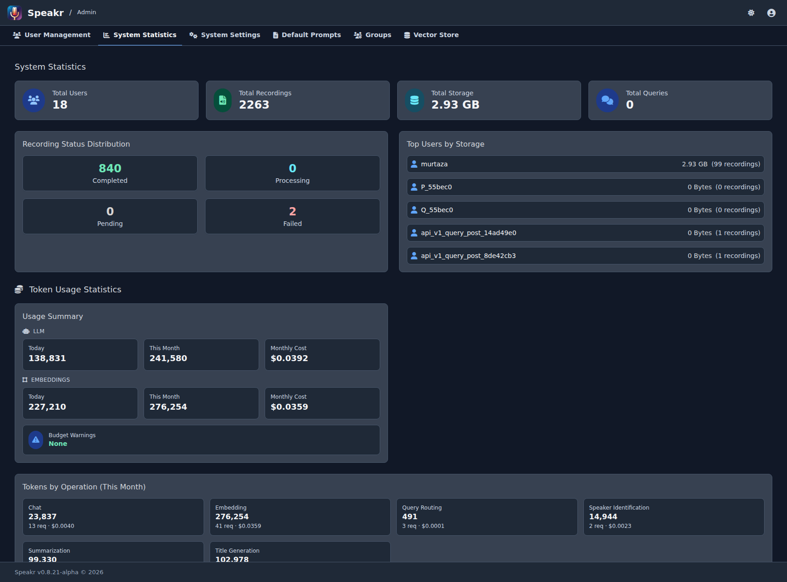

# System Statistics

The System Statistics tab transforms raw data into actionable insights about your PXE MeetingMitra instance. At a glance, you can see how many users you're serving, how many recordings they've created, how much storage they're consuming, and whether everything is processing smoothly.

## Key Metrics Overview

Four prominent cards at the top of the statistics page give you immediate insight into your system's scale. Total Users shows your current user base size, helping you understand your instance's reach. Total Recordings reveals the cumulative content in your system, while Total Storage presents the actual disk space consumed. Total Queries, when Inquire Mode is enabled, indicates how actively users are searching their recordings.

These numbers tell a story about your instance's health and growth. A growing user count with proportional recording growth suggests healthy adoption. Storage growing faster than recordings might indicate users are uploading longer files. Query counts reveal whether users are finding value in the semantic search features.

## Recording Status Distribution

The status distribution section breaks down your recordings into four critical states. Completed recordings are fully processed and ready for use - this should be the vast majority of your content. Processing recordings are currently being transcribed or analyzed. Pending recordings are queued and waiting their turn. Failed recordings encountered errors and need attention.

In a healthy system, you'll see mostly completed recordings with perhaps a few processing at any given moment. A large number of pending recordings might indicate your system is overwhelmed or that background processing has stopped. Failed recordings always deserve investigation - they might reveal configuration issues, API problems, or corrupted files that users are trying to upload.

## Storage Analysis

The "Top Users by Storage" section reveals who's consuming the most resources in your system. Each user is listed with their total storage consumption and recording count, giving you context about whether they have many small files or fewer large ones.

This information proves invaluable for capacity planning and user education. If one user consumes disproportionate storage, you might need to understand their use case better. Are they recording multi-hour meetings? Keeping everything forever? Understanding the why behind the numbers helps you make better policy decisions.

## Understanding Usage Patterns

Statistics aren't just numbers - they're insights waiting to be discovered. Sudden spikes in recordings might coincide with project kickoffs, academic semesters, or company initiatives. Storage growth that outpaces recording growth could indicate users are uploading longer content or higher quality audio files.

Regular monitoring helps you spot trends before they become problems. If storage grows 10% monthly, you can project when you'll need to expand capacity. If failed recordings suddenly spike, you can investigate whether an API key expired or a service is down.

## Capacity Planning

System statistics are your crystal ball for infrastructure needs. Storage growth trends tell you when you'll need more disk space. User growth patterns indicate when you might need to scale your server resources. Processing queues reveal whether your current setup can handle the workload.

Use these insights proactively. If you see storage growing at 50GB monthly and you have 200GB free, you know you have about four months before needing intervention. This lead time lets you budget for upgrades, plan migrations, or implement retention policies before hitting critical limits.

## Token Usage Statistics

The Token Usage section provides visibility into LLM API consumption across your instance. Two cards split usage between **LLM operations** (title generation, summarization, chat, event extraction) and **embeddings** (Inquire mode), since they typically come from different providers and the embedding cost is otherwise easy to miss.

**Per-Operation Breakdown**: LLM token usage is broken down by operation type so you can see where the spend is going. Title generation, summarization, chat, and event extraction each get their own line with input tokens, output tokens, and estimated cost. Embedding usage is shown as a separate card with its own daily/monthly chart, so a model swap or a re-embed-all run is visible without polluting the LLM-side numbers. This separation matters because the embedding API price (per million tokens) is usually orders of magnitude lower than chat-completion pricing, and mixing them makes both numbers harder to read.

**Daily and Monthly Charts**: Interactive charts display token consumption trends over the last 30 days and 12 months for both LLM and embedding usage. These visualisations help identify usage patterns and predict future costs.

**Per-User Breakdown**: A detailed table shows each user's monthly token consumption alongside their budget limit (if set). Progress bars indicate how much of their budget has been used:

- Green: Under 80% of budget
- Yellow: Between 80-100% (warning zone)
- Red: At or over 100% (blocked)

**Cost Tracking**: When using OpenRouter or other providers that return cost information, the statistics include estimated costs based on actual API responses. For embeddings, the cost is calculated from the configured per-million-token price for the active embedding provider. This helps with budgeting and identifying high-cost operations.

Use token statistics to identify heavy users, validate budget allocations, and forecast API costs. If certain users consistently hit their limits, you may need to increase their budgets or investigate their usage patterns. See [Token Budget Management](user-management.md#token-budget-management) for setting individual user limits.

## Transcription Usage Statistics

The Transcription Usage section provides visibility into speech-to-text API consumption across your instance. This is separate from token usage and tracks audio transcription specifically.

**Summary Cards**: Four cards at the top show:

- **Today's Minutes**: Transcription minutes used today across all users
- **This Month**: Total minutes transcribed in the current calendar month
- **Monthly Cost**: Estimated costs based on connector pricing (OpenAI Whisper/Transcribe charges, $0 for self-hosted ASR)
- **Budget Warnings**: Count of users approaching (80%+) or exceeding (100%) their transcription budgets

**Per-User Breakdown**: A detailed list shows each user's monthly transcription usage alongside their budget limit (if set). Progress bars indicate budget consumption:

- Green: Under 80% of budget
- Yellow: Between 80-100% (warning zone)
- Red: At or over 100% (blocked from new transcriptions)

**Cost Estimation**: The system calculates estimated costs based on the transcription connector used:

- OpenAI Whisper API: $0.006 per minute
- OpenAI Transcribe (gpt-4o-transcribe): $0.006 per minute
- OpenAI Transcribe (gpt-4o-mini-transcribe): $0.003 per minute
- Self-hosted ASR endpoints: $0 (no external API costs)

Use transcription statistics to monitor usage patterns, identify heavy users, and validate budget allocations. Organizations using cloud transcription services can forecast costs accurately, while those with self-hosted ASR can track capacity utilization. See [Transcription Budget Management](user-management.md#transcription-budget-management) for setting individual user limits.

---

Next: [System Settings](system-settings.md) →