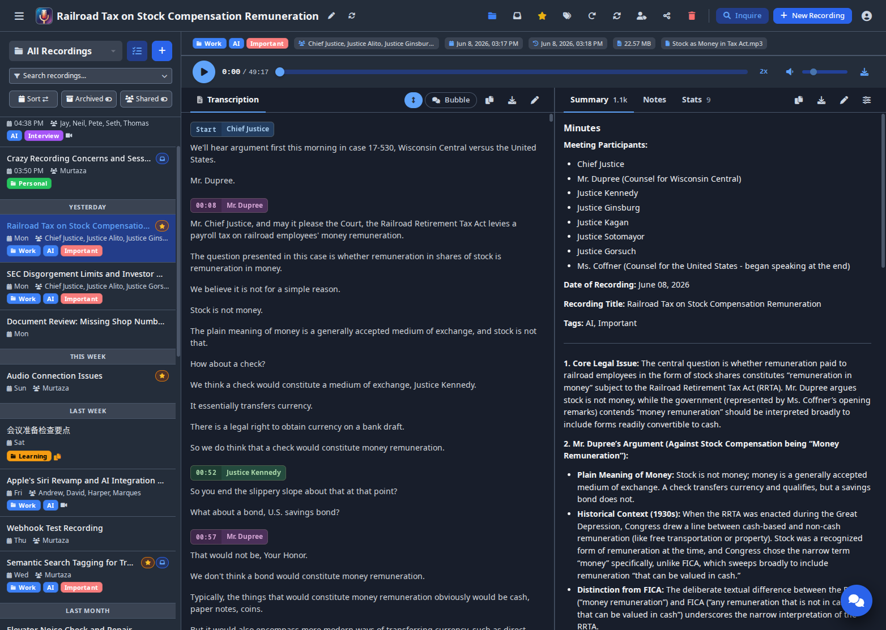
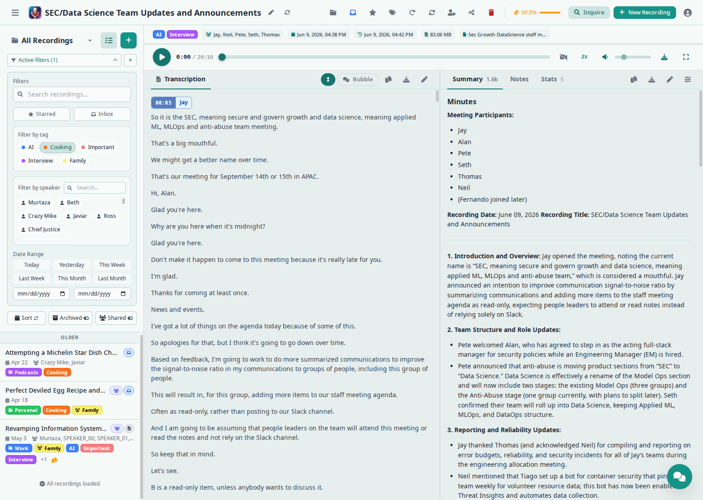
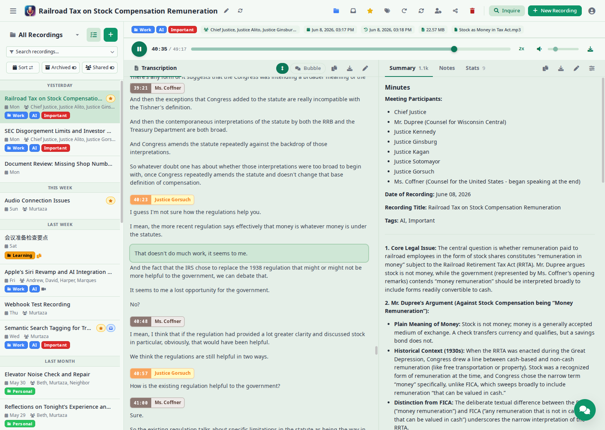
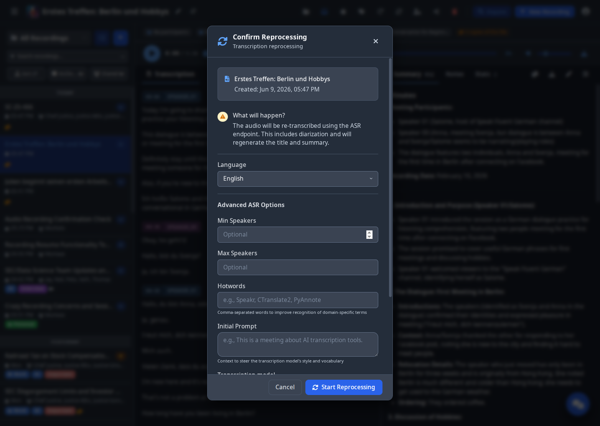
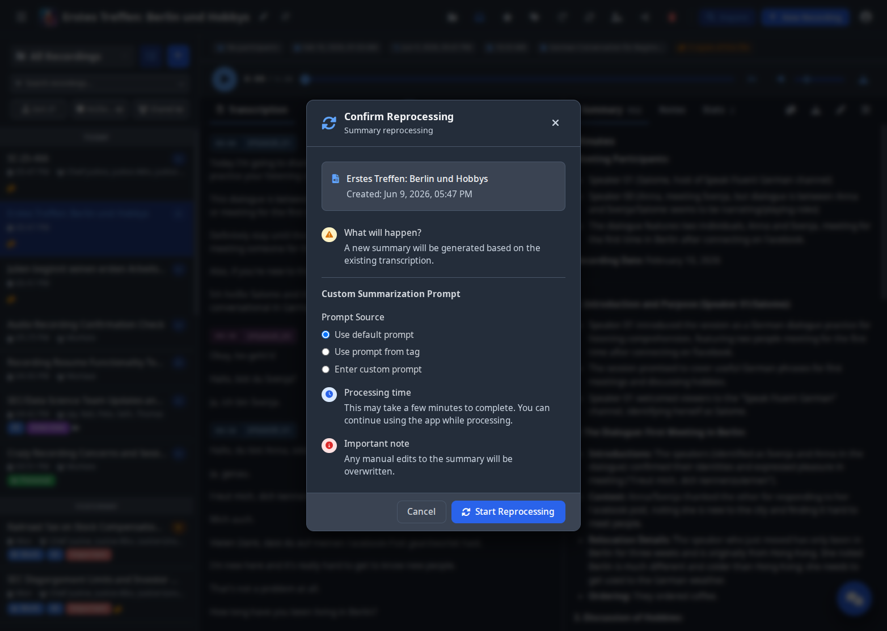

# Main View

The PXE MeetingMitra main view is where you'll spend most of your time. It's designed as a three-panel interface that makes it easy to navigate your recordings, review transcriptions, and interact with your content. Understanding each component will help you work more efficiently with your audio recordings.

## Understanding the Interface Layout

The main view is organized into three distinct sections that work together seamlessly. On the left, you have the recordings sidebar where all your audio files are listed and can be filtered. The center panel displays the full transcription of your selected recording. If your recording was processed with ASR and speaker diarization, you'll see speaker labels and can click any sentence to jump to that position in the audio. The right panel contains the AI-generated summary, your personal notes, and an interactive chat interface. Above both the center and right panels, spanning across the top, is the metadata bar with recording information and action buttons.

## Top Navigation Bar

The header is a single adaptive bar — in list view it shows the PXE MeetingMitra logo and global controls; when you open a recording it consolidates to also show the recording title, the edit pen, regenerate-title button, status badge, and the row of action icons (folder, inbox, star, tags, reprocess transcription, regenerate summary, identify speakers, share, delete). On the right side, the **Inquire** button opens semantic search across all your recordings, the **+ New Recording** button opens the upload modal as an overlay (your current detail view stays visible behind), and your username appears with a dropdown menu containing settings, language preferences, dark mode toggle, color scheme picker, and logout.

On mobile the header keeps just the title, edit pen, regenerate-title, search, +, and user menu — the per-recording action toolbar moves into the chevron-expand row of the detail view below.

## Left Sidebar - Recording List and Filters

The left sidebar is your command center for organizing and finding recordings. At the top, you'll see a search bar that lets you quickly find recordings by title or content. Below that, the filter system helps you narrow down your recording list.

### Using Filters

The filter system in PXE MeetingMitra is designed to be both powerful and intuitive. Click on "Active filters" to expand the filtering panel. You can filter by tags, which appear as colored pills that you can click to select or deselect. The date range filter offers convenient presets like "Today", "Yesterday", "This Week", and "Last Week", or you can set a custom date range using the date pickers. When filters are active, their count appears next to the filter label, and a clear button lets you reset all filters at once.

### Recording List

Below the filters, your recordings are displayed as cards showing essential information at a glance. Each recording card displays the title prominently, followed by metadata including the participants (if speaker diarization was used), the recording date, and the duration. Colored tag pills show which categories have been assigned to each recording. The small icons on the right indicate the recording's processing status, with different colors for completed, processing, or failed transcriptions.

## Center Panel - Transcription View

The center panel is where you'll read and interact with your transcription. This is the heart of PXE MeetingMitra, displaying the complete text of your recording.

### Transcription Display

The transcription display varies depending on how your audio was processed. If you used a standard Whisper API endpoint, you'll see a simple continuous text transcription without speaker identification. The text flows as a single narrative, which works well for single-speaker recordings or when speaker identification isn't needed.

If you've used an ASR endpoint with speaker diarization enabled, each speaker's contributions are clearly labeled with colored tags like "SPEAKER_01", "SPEAKER_02", etc. These labels are color-coded to help you follow multi-person conversations visually. While timestamps aren't displayed in the text, clicking on any sentence will automatically move the audio player to that exact position, making it easy to navigate through the recording.

### View Options

Above the transcription, several buttons control how the content is displayed. The Copy button lets you copy the entire transcription to your clipboard. The Edit button enables inline editing of the transcription if you need to make corrections.

If your recording was processed with speaker diarization, you'll also see a Simple/Bubble toggle that switches between a flowing text view and a conversation bubble format. This toggle is only available when speaker identification is present in the transcription.

## Recording Metadata Bar

Spanning across the top of both the center and right panels, the metadata bar displays important recording information and provides quick access to actions. From left to right, you'll see the recording title, participant names (if identified), recording date and time, file size, and duration. The action buttons (folder, inbox, star, tags, reprocess, regenerate summary, identify speakers, share, delete) are now consolidated into the global header alongside the title — same icons, one row.

## Right Rail Tabs (Desktop)

The right-rail carries three core tabs (Summary, Notes, Chat) plus two contextual ones that appear when applicable:

- **Stats** — A per-recording metrics tab with total length, speaker count, conversation turns, word count as headline cards, then a per-speaker table showing each speaker's speaking time, percentage of total audio, turn count, words, and words-per-minute. A trailing silence row shows how much of the recording was actually quiet. The tab only appears when the transcript has speaker diarisation with per-segment timestamps.
- **Events** — Extracted calendar events from the transcript when present, with export-to-ICS.

The tab bar carries an inline action toolbar on the right (copy / download / edit for Summary and Notes; export-to-calendar for Events) so per-tab actions are reachable without leaving the tab.

## Right Panel - Playback, Summary, Notes, and Chat

The right panel contains three tabbed sections that enhance your transcription with AI-powered features and personal annotations.

### Playback Controls

At the top of the right panel, you'll find the audio player controls. The play button starts and pauses playback, while the timeline shows your current position in the recording. You can click anywhere on the timeline to jump to that point. The speed control lets you adjust playback from 0.5x to 3x speed, which is particularly useful for quickly reviewing content or carefully analyzing specific sections.

If your recording has speaker diarization, clicking on any sentence in the transcription will automatically seek the audio player to that exact moment, providing seamless navigation through the recording.

### Summary Tab

The Summary tab displays an AI-generated overview of your recording. This summary captures the key points, decisions, and action items from your recording, saving you time when reviewing content. The summary is automatically generated after transcription completes but can be regenerated with different settings if needed.

### Notes Tab

The Notes tab is your personal workspace for adding context, thoughts, or follow-up items related to the recording. These notes are private to you and searchable, making them perfect for adding meeting outcomes, personal reminders, or additional context that wasn't captured in the recording. The notes support markdown formatting, allowing you to create lists, headers, and formatted text.

### Chat Tab

The Chat tab provides an interactive AI assistant that can answer questions about your recording. Simply type a question like "What were the main decisions made?" or "What did John say about the budget?" and the AI will analyze the transcription to provide relevant answers. This is particularly useful for long recordings where you need to quickly find specific information.

## Reprocessing Options

PXE MeetingMitra provides two types of reprocessing to update your recordings with improved settings or different parameters.

### Full Reprocessing

Full reprocessing completely re-transcribes your audio file using the ASR endpoint. This is useful when you want to change speaker diarization settings or use a different transcription model. Access this by clicking the refresh icon in the metadata bar and selecting "Transcription Reprocessing". You can adjust the language setting, minimum and maximum speakers for diarization, and other ASR-specific options. Note that full reprocessing will overwrite any manual edits you've made to the transcription.

### Summary Reprocessing

Summary reprocessing generates a new title and summary based on the existing transcription. This is faster than full reprocessing and preserves any edits you've made to the transcription text. Use this when you want to regenerate the summary with different AI settings or after making significant edits to the transcription. Access this option from the same refresh menu by selecting "Summary Reprocessing".

## Working with Multiple Recordings

The main view is designed to handle large libraries of recordings efficiently. You can combine multiple filters to find exactly what you're looking for. For example, you might filter for all "Meeting" tagged recordings from last week that mention "budget" in the transcription. The filters work together, narrowing down your results with each additional criterion.

When working with many recordings, consider using the sort options to organize by either creation date (when you uploaded or recorded) or meeting date (when the recording actually took place). This distinction is particularly useful when you're uploading older recordings or processing a backlog of audio files.

## Tips for Effective Use

To get the most out of the main view, develop a consistent tagging strategy early on. Create tags for different projects, clients, or meeting types, and apply them consistently. This small investment of time pays dividends when you need to find specific recordings later.

The search function is powerful but works best with specific terms. Instead of searching for common words like "the" or "meeting", search for unique terms, project names, or specific topics discussed in your recordings.

Make use of the notes section immediately after meetings while the context is fresh in your mind. These personal annotations become invaluable when revisiting recordings weeks or months later.

For long recordings, the chat interface can save significant time. Instead of reading through an entire hour-long transcription, ask the AI specific questions about decisions made, action items assigned, or topics discussed.

Remember that the interface updates in real-time. When you upload a new recording or when transcription completes, the interface will automatically refresh to show the latest status. You don't need to manually reload the page to see updates.

## Collaboration Features (Optional)

If you're working with a team or family, PXE MeetingMitra's collaboration features help you automatically share recordings with the right people. This section covers groups, group tags, and sharing - all optional but powerful when you need them.

### Understanding Groups and Group Tags

**Groups** are collections of users who regularly work together (e.g., "Engineering Team", "Family", "Sales Department"). Your administrator creates and manages groups, and you're automatically a member of any groups you've been added to.

**Group Tags** are special tags that belong to a group. When you apply a group tag to a recording, all current members of that group automatically get access to it. This is perfect for project-specific content, department meetings, or family events that everyone should see.

### Using Group Tags to Share Recordings

If your administrator has created groups and group tags for you:

1. When creating or editing a recording, click the **tag icon** in the metadata bar
2. Look for tags that show a group indicator (these are your group tags)
3. Select any group tag to apply it
4. All group members instantly receive access to this recording

Group tags can also include custom AI prompts for specialized summaries and retention policies for automatic cleanup. For example, a "Daily Standup" group tag might auto-delete recordings after 14 days, while a "Legal Consultations" tag keeps recordings permanently.

### Individual Sharing

For one-off collaborations or sharing with specific people outside your groups:

1. Open the recording you want to share
2. Click the **share icon** (users icon) in the toolbar
3. Search for the user's name and select them
4. Choose their permission level:
    - **View Only**: Can read and listen, but not edit
    - **Edit**: Can modify metadata, notes, and summary
    - **Reshare**: Can share with additional users
5. Click to add them - they immediately receive access

### Personal Notes on Shared Recordings

When someone shares a recording with you, you can add your own private notes that only you can see. This is perfect for tracking your action items or personal observations without cluttering the shared content. Your notes are completely separate from the recording owner's notes and the shared summary.

To add personal notes to a shared recording, simply click on the **Notes** tab and start typing. These notes are yours alone and won't be visible to the recording owner or other people who have access.

### Viewing Recordings Shared With You

Recordings that others have shared with you appear in your main recording list with a subtle visual indicator. Use the **"Shared with Me"** filter in the sidebar to view only recordings others have shared with you, making it easy to focus on collaborative content.

For complete details on all collaboration features, see the [Sharing & Collaboration guide](sharing.md).

## Creating New Content

Now that you understand how to navigate and interact with existing recordings in the main view, let's explore how to create new content. PXE MeetingMitra offers two ways to add recordings to your library: uploading existing audio files or recording directly in your browser.

---

Next: [Recording and Uploading Audio](recording.md) →