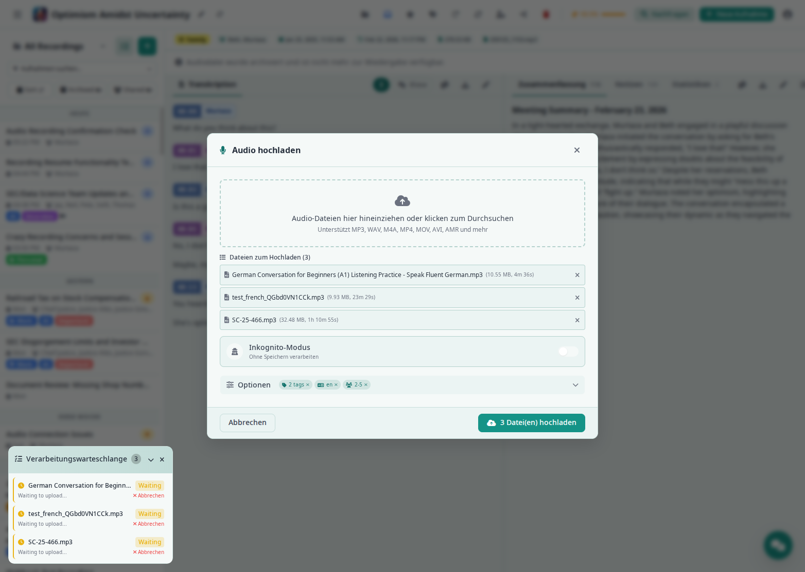
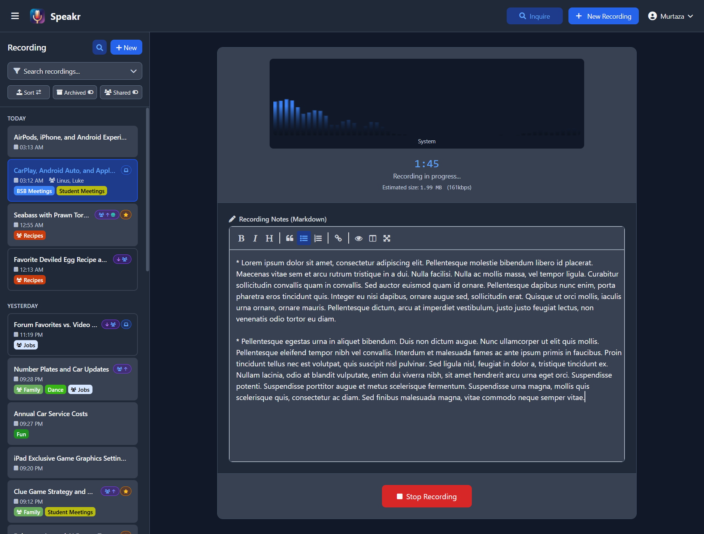
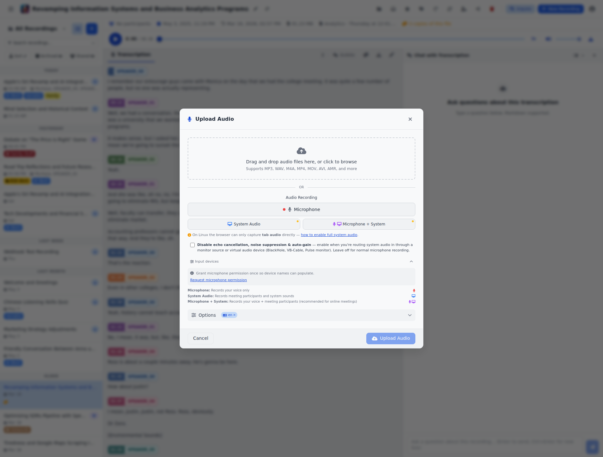
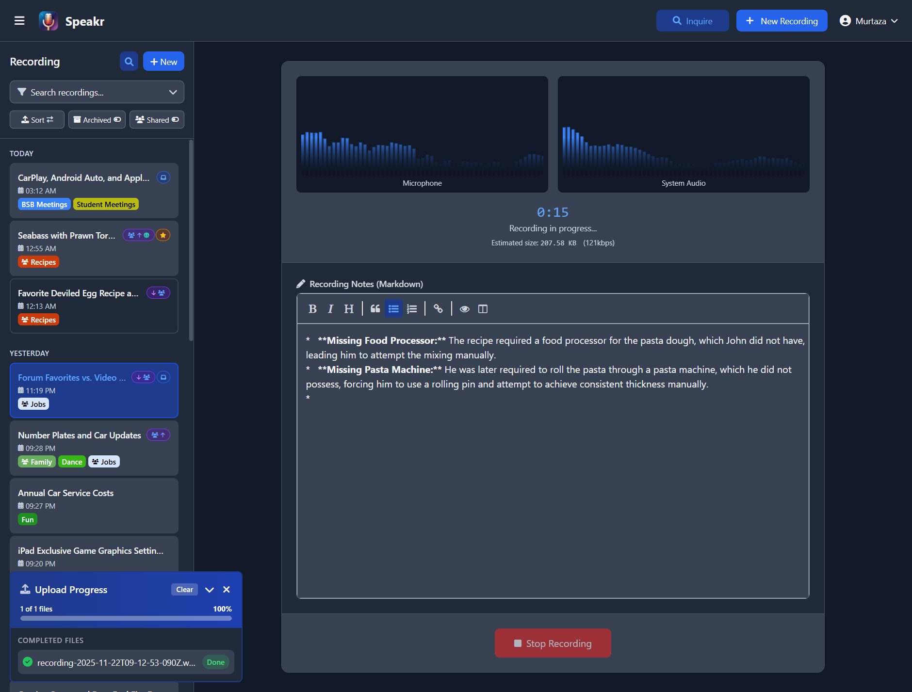
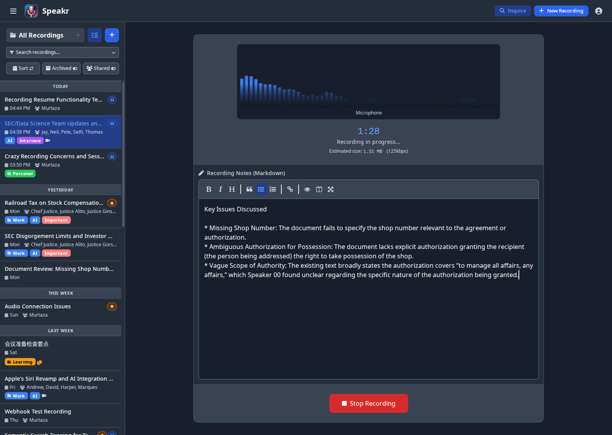
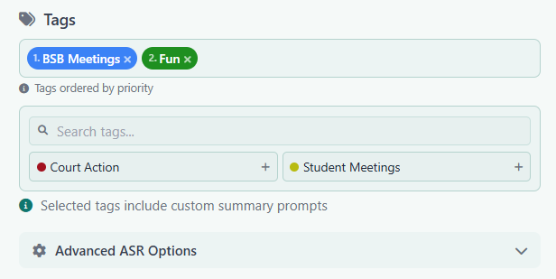

# Recording and Uploading Audio

PXE MeetingMitra provides two powerful ways to add content to your library: uploading existing audio files for transcription or recording new audio directly in your browser. Both methods include the same powerful features for organization, [tagging](settings.md#tag-management-tab), and processing. After recording, you can [work with transcriptions](transcripts.md) and use [AI features](../features.md#ai-powered-intelligence).

## Important: Browser Requirements for Recording

Browser security features affect your ability to record audio, especially system audio. Most browsers require HTTPS for audio capture (localhost is a permitted exception). If you're accessing PXE MeetingMitra over HTTP from another machine on your network, you may need to configure your browser to allow audio recording on insecure connections — instructions are at the bottom of this page.

When recording system audio, you'll grant screen sharing permission and tick a **"Share system audio"** (or **"Share tab audio"**) checkbox in the share dialog. Different browsers phrase the checkbox slightly differently but the option is always there for the capture modes that work on your platform — see the [platform support matrix](#platform-support-matrix) below for which capture modes work on which OS / browser combinations.

## Accessing the Upload Modal

Click the **+ New Recording** button in the top navigation bar (or from the empty-state landing card, or via the deep-link from Inquire mode). This opens the upload modal over your recordings list or the open recording's detail view — backdrop click and Esc dismiss without uploading.



## Uploading Audio Files

The upload interface provides a simple drag-and-drop area at the top of the screen. You can either drag audio files directly from your file manager onto this area, or click the area to open a file browser and select files.

PXE MeetingMitra supports a [wide range of audio and video formats](../faq.md#what-audio-formats-does-speakr-support). Common audio formats like MP3, WAV, M4A, FLAC, AAC, and OGG work perfectly. You can also upload video files including MP4, MOV, and AVI, and PXE MeetingMitra will extract and process the audio track. Mobile recordings in formats like AMR, 3GP, and 3GPP are also supported. The default file size limit is 500MB, though this can be configured by your administrator in [system settings](../admin-guide/system-settings.md#maximum-file-size). For files over 25MB with OpenAI, see [chunking configuration](../troubleshooting.md#files-over-25mb-fail-with-openai).

!!! info "Automatic Audio Compression"
    PXE MeetingMitra automatically compresses lossless uploads (WAV, AIFF) to save storage space. A 500MB WAV file typically becomes ~50MB after compression. This happens transparently on upload - you don't need to pre-convert your files. Already-compressed formats like MP3 are kept as-is. See [audio compression settings](../admin-guide/system-settings.md#audio-compression) for configuration options.

When you upload a file, it immediately appears in the upload queue with a progress bar showing the upload status. Once uploaded, you can add [tags](settings.md#tag-management-tab), set a custom title, and configure processing options before starting transcription. Tags can include [custom AI prompts](../admin-guide/prompts.md) for specialized processing.

## Recording Live Audio

The upload modal includes three recording buttons under the drag-and-drop file area. **Microphone** sits as the full-width primary button (the everyday case); **System Audio** and **Mic + System** sit on a secondary tier with smaller buttons and coloured icon accents. A small amber dot appears on the System Audio / Mic + System buttons when full system audio isn't expected to work on the platform PXE MeetingMitra detected (more on this in the [platform matrix](#platform-support-matrix) below) — clicking the button still works for tab audio in that case, with a help-modal link explaining the workaround.



### Microphone Recording

Captures audio from your selected microphone. Perfect for in-person meetings, personal voice notes, and interviews. The browser will prompt for microphone permission the first time. By default PXE MeetingMitra uses your operating system's default input; pick a specific device via the **Input devices** picker (described below) if you want a USB headset, a virtual audio device, or a Pulse monitor source instead.

### System Audio Recording

Captures audio playing through your computer (or a specific browser tab) via the browser's screen-share API. Ideal for recording online meetings when you're primarily listening, webinars, online presentations, podcasts, or any audio playing locally. When you click the button, the browser shows its share dialog — pick **Entire Screen**, a **Window**, or a **Tab**, then tick the **Share system audio** / **Share tab audio** checkbox in the dialog. The checkbox is the critical step; without it the recording will be silent.

### Combined Recording (Microphone + System)

Records both your microphone AND system audio simultaneously, mixed into a single synchronized track. The recommended mode for online meetings where you're an active participant — it captures both sides of the conversation. Same share dialog as System Audio Recording, with the same Share system audio checkbox requirement.

## Platform Support Matrix

The browser's `getDisplayMedia` API gates what system-audio capture modes actually work. PXE MeetingMitra detects your OS and browser and shows platform-aware hints inline, but the matrix is summarized here:

| Browser | OS | Tab audio | Window audio | Full system audio |
|---|---|---|---|---|
| Chrome / Edge | Windows / ChromeOS | ✅ | ✅ | ✅ via "Share system audio" checkbox |
| Chrome / Edge | macOS | ✅ (only when sharing a tab) | ❌ | ❌ — needs a virtual audio device |
| Chrome / Edge | Linux | ✅ (only when sharing a tab) | ❌ | ❌ — needs a Pulse monitor source |
| Firefox | any OS | ❌ | ❌ | ❌ — no audio via getDisplayMedia |
| Safari | any OS | ❌ | ❌ | ❌ — no audio via getDisplayMedia |

If you click System Audio or Mic + System on a platform where capture won't deliver an audio track, PXE MeetingMitra opens a per-OS help guide automatically. The guide tabs are described below.

## Per-OS Setup for System Audio

### macOS

macOS doesn't let any browser capture system audio directly — the OS treats audio capture as a privileged operation that browsers (sandboxed apps) can't request. There are two paths:

**Option A. Tab audio (no install).** Play the source content in a Chrome tab (YouTube, Zoom web, meeting URL, etc.), click **System Audio** in PXE MeetingMitra, pick that tab in the share dialog, tick **Share tab audio**. Works only for content playing inside a browser tab — native app audio (Slack desktop, native Zoom client, etc.) won't be captured.

**Option B. Virtual audio device (recommended for native app audio).** Install [BlackHole 2ch](https://existential.audio/blackhole/) (free; installer signs cleanly with no kernel-extension prompts). Open **Audio MIDI Setup**, create a **Multi-Output Device** containing your speakers + BlackHole, and set this as your system output. In PXE MeetingMitra, click **Microphone** and pick **BlackHole 2ch** as the input. Once set up, system audio captures continuously regardless of which tab or window is active. Alternative paid tools: [Loopback](https://rogueamoeba.com/loopback/) (Rogue Amoeba) is the most polished UX.

### Windows

Chrome and Edge on Windows are the easiest path — system-wide capture works out of the box:

1. Click **System Audio** or **Mic + System** in PXE MeetingMitra
2. Pick **Entire Screen** in the share dialog
3. Tick **Share system audio** (bottom-left of the dialog)
4. Click **Share**

Per-window capture is also available: pick **Window** instead of Entire Screen, choose the specific app, tick **Share window audio**. Useful for meeting recordings without your own keyboard/typing noise.

If you hit "no audio track" errors with specific apps (Spotify desktop, DRM-protected video sometimes suppress system-audio capture), the standard workaround is a virtual cable like [VB-Audio Cable](https://vb-audio.com/Cable/).

### Linux

Linux has three distinct paths. Pick the one that matches what you want to capture:

**Option A. Tab audio (no setup).** Play the source content in a Chrome tab, click **System Audio**, pick the tab in the share dialog, tick **Share tab audio**. Note: this won't show up in pavucontrol. Chrome captures tab audio internally and never routes through PulseAudio, so the Recording tab will say "No application is currently recording audio." That's normal — PXE MeetingMitra's meter is the source of truth. Only captures audio playing inside a browser tab; native apps (Slack, Spotify desktop, Discord) won't be picked up.

**Option B. Switch source in pavucontrol mid-recording.** Quick but limited — captures system audio at the cost of your mic input. Useful only when you want to record what's playing through your headphones / speakers without your own voice. Click **Microphone** in PXE MeetingMitra, open `pavucontrol` → **Recording** tab, change PXE MeetingMitra's capture source from your mic to **Monitor of &lt;your output&gt;**.

**Option C. Expose a virtual source so Chrome will list it (recommended).** Chrome on Linux deliberately filters "Monitor of …" sources out of the input device list it exposes to web apps — that's why PXE MeetingMitra's input-device picker doesn't show them even though pavucontrol does. The fix is to wrap a monitor source in a regular virtual source that Chrome doesn't filter. Once you do this, the new source appears in PXE MeetingMitra's picker and you can use it as either the primary input OR as a "Also mix in" alongside your real mic.

Find your output sink name (the part before `.monitor`):

```bash
pactl list short sinks
```

Then wrap its monitor as a virtual source Chrome will list:

```bash
pactl load-module module-virtual-source \
    source_name=speakr_loopback \
    master=<sink_name>.monitor
```

Reload PXE MeetingMitra's input-device picker — you'll now see `speakr_loopback` in the dropdown. Pick it as **"Also mix in"** alongside your real mic and you'll capture both. To persist across reboots, add the `load-module` line (without `pactl`) to `~/.config/pulse/default.pa`.

**PipeWire (newer distros).** Same idea — wrap the monitor in a virtual source so Chrome doesn't filter it. Use `pw-loopback`:

```bash
pw-loopback \
  --capture-props='node.target=<sink>.monitor' \
  --playback-props='media.class=Audio/Source node.name=speakr_loopback'
```

Or use `qpwgraph` / `helvum` to wire it visually.

## Input Device Picker & Multi-Input Recording

Under the recording buttons is a collapsible **Input devices** section. Expanded, it shows two dropdowns:



- **Primary input** — defaults to your OS's default microphone. Pick a specific input here if you want a USB headset, BlackHole, VB-Cable, or a Pulse / PipeWire monitor source as your primary capture device. Virtual / monitor entries are badged.
- **Also mix in (optional)** — pick a second input device and PXE MeetingMitra will capture both streams in parallel and mix them via Web Audio into one MediaRecorder track. This is the canonical solution for **capturing both sides of a meeting** on macOS or Linux where the browser can't capture full system audio natively — set your real mic as Primary, set BlackHole / `speakr_loopback` / VB-Cable as the secondary, and one recording captures your voice plus the remote participants.

Device labels are blank until you grant microphone permission. The first time you expand the picker, click the **Request microphone permission** link so the OS shows the prompt; subsequent recordings remember the permission and the labels populate.

**Persistence**: the primary + secondary device choices are saved in `localStorage` so you configure them once and they survive across sessions.

### Disable echo cancellation, noise suppression & auto-gain

A small checkbox below the recording buttons disables Chrome's default audio processing trio:

```
[ ] Disable echo cancellation, noise suppression & auto-gain
    — enable when you're routing system audio in through a monitor source
      or virtual audio device. Leave off for normal microphone recording.
```

Why this matters: Chrome's `noiseSuppression` algorithm is tuned for human voice next to a microphone. When you route sustained speech or music through a monitor source / virtual audio device, the algorithm classifies the sustained audio as noise and gates the stream to silence about a second in. Turning the processing off is necessary for monitor-source capture to actually produce audio. The choice persists in `localStorage`.

For a normal microphone recording (mic in front of your face, in a quiet room), leave this off — Chrome's processing meaningfully improves audibility.

## Privacy Notes for Virtual Audio Devices

Once you install BlackHole / Loopback on macOS, VB-Cable / Voicemeeter / Stereo Mix on Windows, or load `speakr_loopback` (or any virtual source) on Linux, that device shows up in `navigator.mediaDevices.enumerateDevices()` alongside your real microphone. **Any site you've granted mic permission to can pick that device and capture whatever audio is flowing through it**, under the same recording indicator the browser shows for normal mic capture — not the "screen sharing" indicator.

Per-OS specifics:

- **macOS (BlackHole / Loopback)** — The device is a permanently installed audio driver. The risk is active only while system audio is actually routed through it, i.e. while your output is set to the Multi-Output Device. When you're not recording, switch the system output back to your normal speakers so nothing flows through BlackHole.
- **Windows (VB-Cable, Voicemeeter, Stereo Mix)** — Same pattern. The risk is active while audio is routed through the cable. Native "Share system audio" via the share dialog has no comparable exposure because nothing is routed through a virtual mic.
- **Linux (`speakr_loopback`)** — Chrome's filtering of "Monitor of …" sources is a deliberate privacy protection. The `module-virtual-source` wrap explicitly undoes that protection. Unlike macOS / Windows the device is a runtime module you can `pactl unload-module` at will.

**Mitigations (apply on every OS):**

- **Route through the virtual device only while recording.** On macOS, switch the system output back to your speakers after. On Windows, stop routing through the cable. On Linux, `pactl unload-module module-virtual-source` after recording (or simply don't add the `load-module` line to `default.pa`).
- **Audit your mic permissions** at `chrome://settings/content/microphone` and remove any site that doesn't strictly need it.
- **Use a less obvious device name** where you can choose one (e.g. `aux_in` instead of `speakr_loopback`). Doesn't stop a determined enumerator but raises the bar.

**Where the audio ends up**: Captured audio goes to your PXE MeetingMitra server (self-hosted by you) and then to whichever ASR endpoint you've configured. If you're running a local Whisper / self-hosted ASR, audio never leaves your network. If your ASR is OpenAI or another cloud provider, audio gets sent there.

## During Recording - Live Interface

Once you start recording, the interface transforms to show the active recording session:



### Real-Time Audio Monitoring

The recording interface displays live audio visualizers for each active input source. When recording from your microphone, you'll see a real-time waveform showing your voice levels. For system audio recording, a separate visualizer displays the computer audio levels. These visualizers help you confirm that audio is being captured properly and at appropriate levels.

A prominent timer at the top shows the elapsed recording time in minutes and seconds, updating in real-time. Below the timer, you'll see an estimate of the file size based on the current recording duration and quality settings. This helps you stay aware of how much storage space your recording will require.

### Live Note-Taking with Markdown

One of PXE MeetingMitra's most powerful features is the ability to take structured notes while recording. The note-taking area appears below the audio visualizers and supports full markdown formatting.



The markdown editor includes a formatting toolbar with buttons for common formatting options like bold, italic, headers, quotes, lists, and links. You can also type markdown syntax directly if you prefer. The editor supports all standard markdown elements, allowing you to create well-structured notes that complement your recording.

Your notes are saved automatically and will be associated with the recording. They appear in the Notes tab when viewing the recording later and are fully searchable alongside the transcription. This makes it easy to capture important context, decisions, or action items that might not be explicitly stated in the audio.

Common use cases for live notes include capturing action items and deadlines during meetings, noting important timestamps for later reference, recording participant names and roles, documenting decisions and their rationale, and adding context that might not be clear from the audio alone.

## Finalizing Your Recording

After stopping a recording or dropping a file, the upload modal stays open so you can review and configure before committing. The modal has four main regions:

**1. File picker / queue.** The drag-and-drop file area at the top, plus the queued files list. Each queued file shows its **name**, **size**, and **duration** (probed asynchronously from the container header so it appears within a fraction of a second — no full payload read). Video files get a sky-blue video glyph instead of the audio one so you can tell which files in the queue are video at a glance.

**2. Recording buttons + Input devices + processing toggle.** Hidden when files are queued (since you're uploading, not recording). Otherwise: the three recording buttons (Microphone, System Audio, Mic + System), the collapsible Input devices picker, the "Disable echo cancellation" toggle, and platform-aware hints.

**3. Options group (progressive disclosure).** Folder, tags, prompt variables, and advanced ASR options are tucked behind a single collapsible **Options** row with a **chip summary** of what's currently set. Chips show the folder pill in its colour, an "N tags" count, a language code if set, and a speaker-count chip if min/max are set — each with an inline × to clear individual selections without expanding the editor. Defaults to collapsed because most uploads inherit your last-used selections (see "Last-used defaults auto-restore" below); click the row to expand for editing.

**4. Sticky modal footer.** Cancel on the left, Upload on the right. The Upload button is disabled until at least one file is queued, then shows "Upload N files" — always reachable while scrolling through long queues or the expanded Options group.

**Last-used defaults auto-restore**: after every successful upload, your form choices (tag IDs, folder, language, min/max speakers) are memo-ed to `localStorage`. The next time you add a file to the queue, those values restore automatically — only filling slots you haven't already set this session. Each chip's × clears that selection if you want different ones this time.

### Adding Tags

The tag system is one of PXE MeetingMitra's most powerful organizational features. Expand the **Options** group to see the tag picker. Tags appear as colored pills that you can select to categorize your recording. You can apply multiple tags to a single recording, making it easy to cross-reference content across different categories.



It's important to select relevant tags before uploading your file so that the appropriate summary prompts are applied during summarization. Each tag can have custom AI prompts associated with it, which influence how the summary is generated. For example, a "Meeting" tag might focus the summary on action items and decisions, while a "Lecture" tag might emphasize key concepts and learning points.

**Intelligent Prompt Stacking:** When you select multiple tags, their associated prompts are concatenated in the order you select them, allowing for intelligent stacking of instructions. This powerful feature lets you combine general and specific prompts. For instance, you might have a standard "Meetings" tag with general meeting instructions, then add a project, client, or situation specific tag that adds additional context and instructions for the summarization. The AI will apply both sets of instructions by concatenating general meeting requirements with the specific modifications. This allows you to create sophisticated summarization rules without having to create a separate tag for every possible combination. To create and manage tags with custom prompts, see [Tag Management in Account Settings](settings.md#tag-management-tab).

As shown in the interface, if you add tags that include summarization instructions, you will get an indication of this in the UI. The order matters - select your primary tag first, then add modifying tags to layer additional instructions. Tags are also searchable and filterable in the main view, making it easy to find related recordings later.

### Advanced ASR Options

If your administrator has configured ASR endpoints with speaker diarization, you'll see an expandable "Advanced ASR Options" section. Here you can specify the transcription language if your content is not in English, set the minimum and maximum number of expected speakers for better diarization accuracy, and configure other ASR-specific settings based on your setup.

These settings are particularly useful for meetings with known participants, as setting accurate speaker counts improves the AI's ability to separate different voices in the transcription.

#### Custom Vocabulary (Hotwords)

The **Hotwords** field lets you provide a comma-separated list of words or phrases that the transcription engine should prioritize. This is especially useful for domain-specific terminology, brand names, acronyms, or proper nouns that the model might otherwise misspell or miss entirely. For example, entering `PXE MeetingMitra, CTranslate2, PyAnnote` helps the engine correctly recognize these terms in your audio.

#### Initial Prompt

The **Initial Prompt** field provides context to the transcription engine about what the recording contains. Think of it as a brief description that steers the model's expectations. For example: "This is a meeting about AI-powered audio transcription tools." This helps the model make better word choices when the audio is ambiguous.

Both fields follow a precedence hierarchy: values you set in the upload form override tag defaults, which override folder defaults, which override your personal defaults in [account settings](settings.md#custom-prompts-tab). If you regularly transcribe similar content, set your defaults at the tag or user level so you don't have to enter them every time.

#### Transcription Model

When your administrator has configured `TRANSCRIPTION_MODELS_AVAILABLE` (or curated a model list from the admin dashboard), the upload form gains a **Transcription model** dropdown that lets you pick the specific model used for this recording. The default option uses whichever model the resolved tag, folder, or admin default specifies. The dropdown is hidden if only one option would be available, since there is no real choice to offer.

Like hotwords and initial prompt, the resolved model follows the precedence chain: per-upload selection beats tag default beats folder default beats the admin default. This is useful when you want to use a higher-quality model for an important recording without changing your defaults, or to fall back to a faster model for a quick transcript.

#### Prompt Variables

If a selected tag, folder, or your account default summary prompt contains `{{name}}` placeholders (for example `{{agenda}}` or `{{location}}`), the upload form shows a **Prompt variables** panel under the tag picker with one input per placeholder. Values entered here are stored on the recording and substituted into the summary prompt at summarisation time. See the [Prompt Variables guide](settings.md#prompt-variables) for the full feature.

### Final Actions

The sticky modal footer holds **Cancel** (dismisses without uploading) and **Upload N files** (begins transcription immediately with your selected settings). The recording appears in your library with a processing indicator while transcription runs in the background. If you started a recording from inside the modal and the upload completes, PXE MeetingMitra auto-navigates to the new recording's detail view; bulk drag-drop uploads of multiple files leave you on whatever you were viewing.

If incognito mode is enabled at the server, a toggle in the upload modal lets you process recordings without saving them to your account. Incognito uploads accept one file at a time.

### Mobile Upload Experience

On phones the modal becomes a **bottom sheet** that slides up from the bottom of the viewport instead of a centered card. The sheet:

- Takes the full viewport width with rounded top corners only
- Carries a small drag-handle bar at the top as a draggability affordance
- Can be **dragged down to dismiss** — pull the header down past 120 px (or 25 % of viewport height) and the sheet animates fully off-screen
- Has a sticky Cancel / Upload footer that sits right above the thumb's natural rest position

The recording buttons, Input devices picker, and Options chip summary all behave identically on mobile and desktop.

## Crash Recovery (v0.6.2+)

!!! success "Automatic Crash Recovery"
    PXE MeetingMitra now automatically saves your in-progress recordings to browser storage every 5 seconds. If your browser crashes, tab closes accidentally, or your computer restarts unexpectedly during a recording, you won't lose your work.

When you return to PXE MeetingMitra after a crash, you'll see a recovery modal offering to restore your interrupted recording:

**What Gets Recovered:**

- All recorded audio up to the point of interruption
- Recording mode (microphone, system audio, or combined)
- Any notes you had entered
- Selected tags and settings
- Exact timestamp when recording started

**How Recovery Works:**

1. When you return to PXE MeetingMitra after a crash, a modal automatically appears
2. Review the recording details (duration, size, timestamp)
3. Click "Restore Recording" to continue where you left off, or "Discard" to start fresh
4. Recovered recordings appear in the finalization screen ready for processing

**Limitations:**

- Recovery data is stored in your browser's IndexedDB storage (per-browser, per-device)
- Clearing browser data will delete recovery information
- Recording chunks are saved every 5 seconds, so up to 5 seconds of audio may be lost

This feature provides peace of mind for long recordings - you can now record multi-hour sessions without fear of losing everything if something goes wrong.

### Server-Side Recording Sessions (long recordings)

If your administrator has enabled **server-side recording sessions**, in-app recordings stream their audio chunks to the server as you record, instead of buffering everything in your browser's memory. This unlocks two things:

- **Multi-hour recordings** — recordings are no longer limited by available browser RAM, so you can capture sessions that run for hours (up to a ceiling set by your administrator, 8 hours by default).
- **Resume after reload** — because the audio lives on the server, you can reload the page mid-recording and pick the session back up rather than losing it.

This is an opt-in feature that is off by default. If you don't see it, ask your administrator to enable it. See [Recording Sessions](../admin-guide/recording-sessions.md) in the admin guide for setup details.

## Best Practices for Quality Recordings

### Mobile Recording Considerations

!!! danger "Keep App Visible on Mobile Devices"
    **Critical Limitation**: Mobile browsers (Chrome, Safari, etc.) will **pause audio recording** when you minimize the app or lock your screen. This is a fundamental browser limitation that cannot be overcome.

    **To record successfully on mobile:**
    - **Keep PXE MeetingMitra visible** in the foreground at all times
    - **Don't minimize** the window or switch to other apps
    - **Don't lock** your screen during recording
    - Wake Lock will **prevent screen from auto-sleeping** while app is visible

    **For long meetings on mobile:**
    1. **Option 1**: Keep PXE MeetingMitra open and visible (wake lock prevents screen sleep)
    2. **Option 2**: Use your phone's native voice recorder app, then upload the file to PXE MeetingMitra when done

    **Desktop browsers don't have this limitation** - recording continues even when minimized.

**Installing as a PWA** - For the best mobile experience, install PXE MeetingMitra as a Progressive Web App. This provides:

- Wake Lock API to prevent screen from auto-sleeping while recording
- Faster load times with offline caching
- Native app-like experience
- Persistent notification during recording

See the [PWA Guide](pwa.md) for installation instructions and important limitations.

### Optimizing Audio Quality

The quality of your transcription starts with the quality of your recording. When using a microphone, find a quiet space with minimal echo and background noise. Soft furnishings and carpeted rooms generally provide better acoustics than empty rooms with hard surfaces. Position your microphone consistently, about 6-12 inches from your mouth, and speak at a steady volume.

**Important Note for Phone Recordings:** Many smartphones have aggressive noise cancellation algorithms designed to enhance single-speaker calls. When recording meetings or conversations with multiple speakers using a phone's microphone, these noise cancellation features may incorrectly identify other speakers as background noise and filter them out. This can result in muffled or missing audio from speakers who are farther from the phone. This is not a limitation of PXE MeetingMitra but rather how modern phones process audio. For multi-speaker recordings, consider using an external microphone without noise cancellation or positioning the phone equidistant from all speakers.

For system audio recording, close unnecessary applications that might produce notification sounds or background audio. If you're recording an online call or web meeting, ensure you have a stable internet connection to avoid audio dropouts. Using wired internet instead of WiFi can improve stability for important recordings.

When recording both microphone and system audio, use headphones to prevent echo and feedback. This ensures that the system audio doesn't get picked up by your microphone, which would create a confusing double recording.

### Effective Organization from the Start

Develop a consistent approach to naming and tagging your recordings. Include key information in titles such as the meeting type, main topic, or project name. If the original meeting date is different from the upload date, make sure you update the meeting date on upload, making chronological sorting easier.

Apply tags before or immediately after recording while the context is fresh in your mind. Consider creating a standard set of tags for different types of content like meetings, lectures, interviews, or personal notes. If your organization uses specific project codes or client names, incorporate these into your tagging system.

Take advantage of the live note-taking feature to capture information that might not be clear from audio alone. Note participant names at the beginning of meetings, mark important timestamps when key decisions are made, and document any visual information that was shared but won't be captured in the audio.


## Browser Configuration for Local Deployments

### System Audio Recording Requirements

System audio recording requires specific browser support and configuration. The feature works best in Chrome and other Chromium-based browsers like Edge or Brave. Firefox has limited support, and Safari currently doesn't support system audio recording at all.

For production deployments using HTTPS, audio recording works without additional configuration. However, if you're accessing PXE MeetingMitra over HTTP (except for localhost), you'll need to configure your browser to allow audio recording on insecure connections.

### Chrome Configuration for HTTP Access

If you're accessing PXE MeetingMitra over HTTP (not localhost), Chrome will block audio recording by default. To enable it:

1. Open Chrome and navigate to `chrome://flags`
2. Search for "Insecure origins treated as secure"
3. In the text field, enter your PXE MeetingMitra URL (e.g., `http://192.168.1.100:8899`)
4. Set the dropdown to "Enabled"
5. Click "Relaunch" to restart Chrome with the new settings

This configuration tells Chrome to treat your specific HTTP URL as if it were secure, enabling all audio recording features.

### Firefox Configuration for HTTP Access

Firefox requires a different approach to enable microphone access on HTTP sites:

1. Open Firefox and navigate to `about:config`
2. Click "Accept the Risk and Continue" when warned
3. Search for `media.devices.insecure.enabled`
4. Double-click the setting to change it from `false` to `true`
5. Restart Firefox for the change to take effect

Note that even with this setting, Firefox's system audio capture may not work reliably. For system audio recording, Chrome is strongly recommended.

### Security Considerations

These browser configurations reduce security and should only be used for local development or trusted internal networks. For production deployments, always use HTTPS with proper SSL certificates. This ensures all browser features work correctly and maintains security for your users.

### Common Issues and Solutions

If your microphone isn't detected, first check that your browser has permission to access it. Click the padlock or information icon in the address bar and ensure microphone access is allowed. Verify your microphone is properly connected and selected as the default input device in your system settings. If problems persist, try using a different browser or restarting your current browser.

When system audio recording isn't working, the most common issue is forgetting to check the "Also share system audio" checkbox when selecting what to share. This checkbox appears at the bottom of the screen/tab selection dialog and must be enabled. Make sure you're selecting either the entire screen or a browser tab, not an individual application window, as application audio sharing is often not supported.

If you're on a locally hosted instance and can't record audio, check whether you're accessing PXE MeetingMitra via HTTP. Browsers block audio recording on insecure connections for security reasons. Either set up HTTPS with a reverse proxy or configure your browser using the instructions above to allow audio recording on your specific HTTP URL.

If a recording stops unexpectedly, check your available disk space as browsers have limits on local storage. Ensure your internet connection is stable, especially if you have auto-save features enabled. Check the browser's developer console (F12) for any error messages that might indicate the problem.

For poor audio quality issues, start by checking your microphone placement and gain settings. External USB microphones often provide better quality than built-in laptop microphones. Reduce background noise by closing windows, turning off fans, and muting other devices. If recording system audio, ensure the source audio quality is good, as PXE MeetingMitra can't improve poor source audio.

## Moving Forward

Now that you understand how to create and upload recordings, you're ready to explore how to work with transcriptions and leverage PXE MeetingMitra's AI-powered features for summarization and chat.

---

Next: [Working with Transcriptions](transcripts.md) →