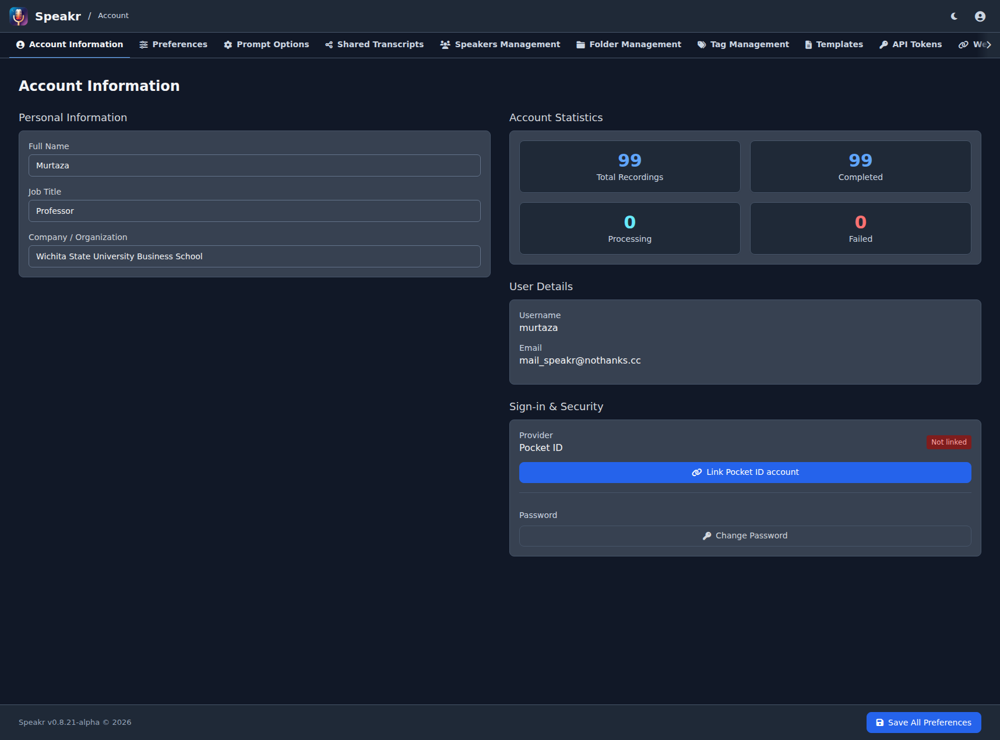
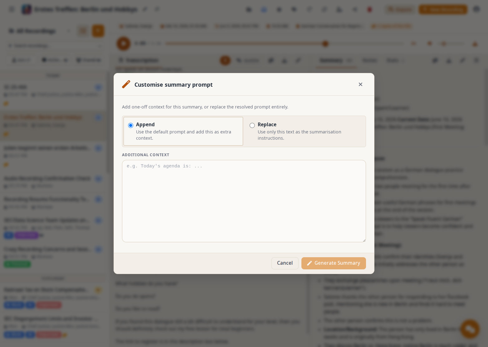
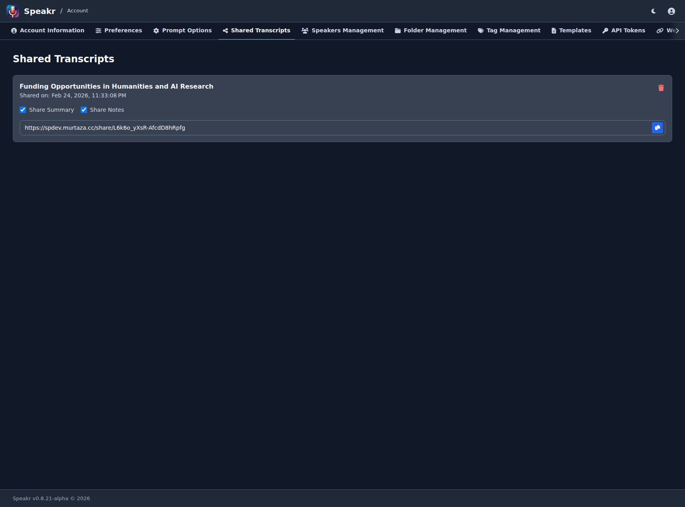
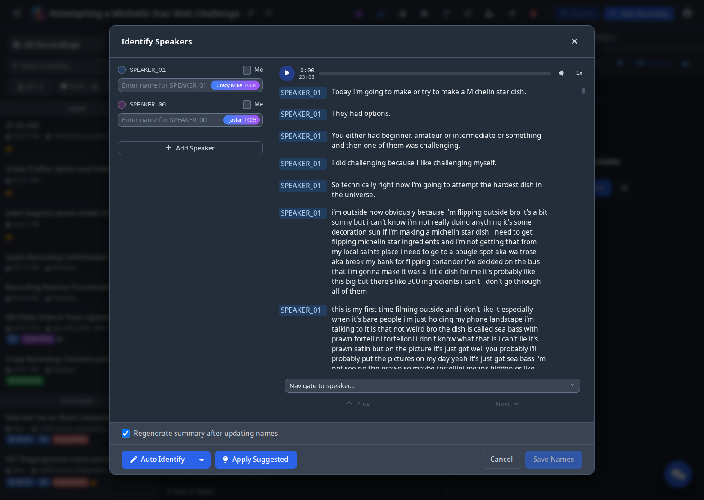
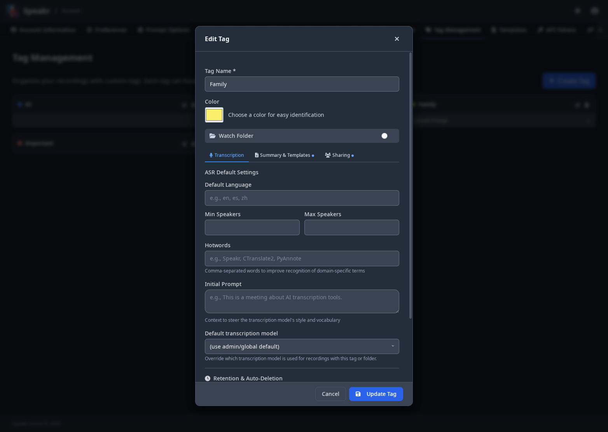
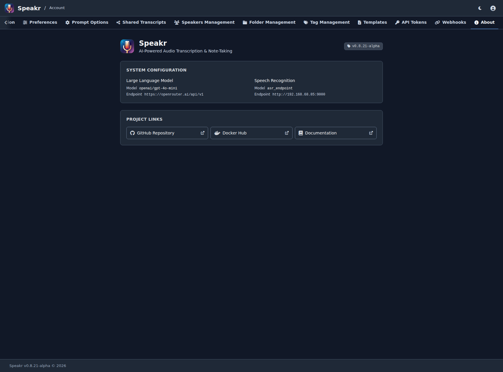

# Account Settings

Your account settings are the control center for personalizing PXE MeetingMitra to work exactly how you need it. Every preference you set here shapes your daily experience, from the language you see to how AI summarizes your recordings. Access these settings by clicking your username in the top navigation and selecting Account.

## Account Information Tab



The Account Information tab presents a comprehensive view of your profile, statistics, and account actions.

### Personal Information

On the left side, you'll find fields to update your full name, job title, and company or organization. These details help identify you in collaborative environments and provide context for your recordings. Keeping these current ensures colleagues can recognize your contributions and administrators can manage users effectively.

Language preferences (interface language, default transcription language, and preferred output language) live on the **Preferences** tab. See the [Preferences Tab](#preferences-tab) section below.

### Account Statistics

The right side displays your recording metrics at a glance. You'll see your total recordings count and how many have been completed processing. Below that, the number of recordings currently processing and any that have failed provide immediate insight into your content status.

### User Details

Your username and email address appear here as read-only fields. The email serves as your login credential and cannot be changed without administrator assistance.

### Processing Preferences

Control how your recordings are automatically processed:

#### Auto-Summarization

The **Auto-Summarization** toggle controls whether summaries are automatically generated after transcription completes. When enabled (the default), every recording receives an AI-generated summary using your custom prompt or the system default. Disable this if you prefer to manually trigger summarization or if you only need transcripts.

#### Auto Speaker Labeling

When you have speaker voice profiles with embeddings (from WhisperX ASR), the **Auto Speaker Labeling** feature can automatically identify and label speakers in new recordings.

- **Enable/Disable** - Toggle automatic speaker identification
- **Confidence Threshold** - Choose how strict the matching should be:
  - **Low** - More matches, but may have false positives
  - **Medium** - Balanced accuracy (recommended)
  - **High** - Fewer matches, but higher confidence

Auto speaker labeling works by comparing voice embeddings from the new recording against your saved speaker profiles. When a match exceeds your confidence threshold, the speaker is automatically labeled with the known name.

!!! tip "Building Voice Profiles"
    Auto speaker labeling requires voice profiles with embeddings. These are created when you identify speakers in recordings processed with WhisperX ASR (with `ASR_RETURN_SPEAKER_EMBEDDINGS=true`). The more recordings you identify a speaker in, the better the matching becomes.

### Account Actions

The account actions section provides quick access to essential functions. The prominent "Go to Recordings" button takes you directly to your recording library. The "Change Password" button opens a secure dialog for updating your credentials. The "Manage Speakers" link provides a shortcut to speaker profile management, though this functionality is also accessible via its dedicated tab.

## Custom Prompts Tab



The Custom Prompts tab unlocks one of PXE MeetingMitra's most powerful features - the ability to shape how AI interprets and summarizes your recordings.

### Your Custom Summary Prompt

The large text area accepts detailed instructions in natural language that become the AI's instruction set. Think of it as teaching an assistant exactly how you want meeting notes prepared. You might request specific sections like "Key Technical Decisions" for engineering meetings or "Patient Observations" for medical consultations.

### Current Default Prompt

Below your custom prompt area, you'll see the default prompt that applies when you leave yours blank. This transparency shows exactly what baseline instructions the AI follows - typically requesting key issues, decisions, and action items. Use this as a foundation to build upon or completely replace with your own approach.

### Prompt Hierarchy

Understanding prompt precedence helps you use this feature effectively. Tag prompts have the highest priority - when you tag a recording with "Legal" or "Sales," any prompts associated with those tags override everything else. Your personal custom prompt comes next, applying to all recordings without tag-specific prompts. Below that sits the admin default set by your PXE MeetingMitra administrator, with a system fallback ensuring summaries always generate.

### Prompt Stacking

Multiple tag prompts combine intelligently when applied together. A recording tagged with both "Client" and "Technical" receives both sets of instructions, creating comprehensive summaries without needing complex single prompts trying to cover every scenario.

### Transcription Hints

Below the summary prompt, you'll find the **Transcription Hints** section with two fields that help improve transcription accuracy:

- **Default Hotwords** - A comma-separated list of words or phrases the transcription engine should prioritize, such as brand names, acronyms, or specialized terminology (e.g., `PXE MeetingMitra, CTranslate2, PyAnnote`).
- **Default Initial Prompt** - A brief description of the typical content of your recordings that provides context to the transcription engine (e.g., "This is a meeting about software development and AI tools.").

These defaults apply to all your recordings unless overridden by tag defaults, folder defaults, or values you set in the upload form's Advanced ASR Options. This is the lowest priority level in the precedence hierarchy, making it a good place to set general-purpose hints that apply across most of your content.

!!! tip "When to use hotwords vs initial prompt"
    Use **hotwords** for specific terms the model tends to misspell - proper nouns, brand names, technical acronyms. Use **initial prompt** for broader context that helps the model understand the domain and make better overall word choices.

### Writing Effective Prompts

Craft prompts based on how you actually use summaries. Do you extract action items for project management? Look for decisions that affect strategy? Track technical details for documentation? Your prompt should request exactly what you need for these next steps.

### Tips for Better Prompts

The expandable tips section provides guidance on crafting better instructions. Focus on clarity, structure your requests with sections or bullet points, and be specific about the level of detail you need. Remember that your prompt applies to all recordings without tag-specific prompts, so design for versatility.

## Preferences Tab

The Preferences tab is the home for display and editor behaviour settings that should follow you across devices.

### Language Preferences

Three language settings shape your PXE MeetingMitra experience. The interface language dropdown immediately transforms all menus, buttons, and messages to your chosen language; the transcription language field sets a default ISO 639-1 code that the recognition service uses to optimise accuracy when auto-detect is too slow or ambiguous; and the preferred output language controls the language of titles, summaries, and chat responses regardless of the source audio's language. Leaving the transcription language on **Auto-detect** is the right default for multilingual content.

These settings used to live on the Account Information tab. They moved here so all preferences that affect your day-to-day PXE MeetingMitra experience live in one place.

### Transcript Display

**Show timestamps in simple view.** When enabled, a compact `mm:ss` (or `h:mm:ss` for long recordings) timestamp appears next to each speaker label in the simple transcript view, making it easier to navigate long meetings. The bubble view is unaffected. Off by default to keep the existing aesthetic for users who prefer a clean read.

### Transcript Editor

**Auto-save edits in the transcript editor.** When enabled, edits made in the transcript editor are saved automatically a couple of seconds after you stop typing, with a small `Saved` indicator to confirm. When disabled (the default), saves are explicit via the Save buttons or the `Ctrl+S` keyboard shortcut. Auto-save is useful for long editing sessions where the risk of losing work outweighs the predictability of explicit writes.

### Display

**Audio player position (desktop only).** Choose whether the persistent audio player sits at the **bottom** of the recording detail surface (default — spans the transcription + right rail with a single-row layout) or at the **top** (above the metadata and content area). The setting is saved on your account and takes effect on every recording. Mobile is unaffected; the mobile audio player always sits between the content area and the bottom navigation.

## Shared Transcripts Tab



The Shared Transcripts tab provides complete visibility and control over every recording you've shared.

### Initial State

When first accessing this tab, you'll see "You have not shared any transcripts yet" - this changes once you create your first share link from any recording.

### Share Information Display

Once you've shared recordings, each entry displays the recording title, when you created the share link, what information you included (summary and/or notes), and the complete URL for access. The interface matches what you see in the sharing modal, maintaining consistency across the application.

### Managing Share Settings

The Share Summary checkbox determines whether recipients see your AI-generated summary - useful for giving quick overviews without requiring full transcript reading. The Share Notes checkbox controls access to your personal notes, those additional thoughts and context you've added after the recording.

You can modify these settings anytime without generating new links. Toggle summary or notes on or off, and the change applies immediately to anyone accessing that link. This flexibility lets you adjust sharing based on evolving needs or feedback from recipients.

### Revoking Access

The delete button (trash icon) immediately revokes access. Once deleted, anyone trying to access that link sees an error message. This instant revocation provides security when you've accidentally shared with wrong parties or when access is no longer appropriate. Remember that deletion can't retrieve information already viewed or downloaded by recipients.

## Speakers Management Tab


*Speakers Management with voice profile statistics, confidence scores, and voice sample playback*

The Speakers Management tab provides a comprehensive interface for managing all speakers identified across your recordings, including advanced voice profile capabilities.

### Automatic Speaker Creation

Speakers are automatically saved when you identify them during transcription editing. The system builds your library over time as you consistently name participants across recordings. When speaker diarization is enabled, PXE MeetingMitra automatically collects voice embeddings to build recognition profiles.

### Speaker Card Information

Each speaker card displays essential information in a clean, scannable format. The speaker's name appears prominently, followed by usage statistics showing how many times they've been identified across your recordings. The last used date helps you understand which speakers are current versus historical. When a speaker was added to your library is tracked for reference.

#### Voice Profile Information

For speakers with voice recognition data, each card displays additional information:

- **Voice Profile Badge**: Shows confidence level (high/medium/low) based on the number and quality of voice samples collected
- **Sample Count**: Number of voice embeddings collected from different recordings, helping assess profile strength
- **Voice Samples Button**: Click to hear representative audio clips of this speaker's voice for verification
- **Profile Strength Indicator**: Visual feedback showing how well the system can recognize this speaker in future recordings

The voice profile data improves speaker suggestion accuracy when identifying speakers in new recordings. When you open the speaker identification modal, PXE MeetingMitra analyzes voice patterns and suggests likely matches with confidence scores, making the identification process faster and more accurate over time.

### Interface Layout

The grid layout accommodates multiple speakers per row, making efficient use of screen space while maintaining readability. Each card includes action buttons - an edit icon for updating speaker details and a delete icon for removal. The red trash icon on each card provides individual deletion, while the "Delete All" button at the bottom enables bulk cleanup when needed.

### Library Statistics

At the bottom of the interface, a count shows your total saved speakers - "77 speakers saved" in the example. This helps you track the size of your speaker library and understand when maintenance might be needed.

### Maintenance Best Practices

Regular maintenance keeps your speaker library relevant. Remove speakers who no longer appear in recordings, consolidate duplicates created with slight name variations, and ensure names are consistent for better transcript coherence. Periodic reviews help keep your library manageable and useful.

### Automatic Speaker Cleanup

When recordings are deleted (either manually or through auto-deletion), PXE MeetingMitra automatically manages speaker voice profiles to protect your privacy:

- **Speakers with remaining recordings**: Voice profiles are preserved and continue to provide recognition suggestions
- **Speakers with no recordings**: Preserved by default. If `DELETE_ORPHANED_SPEAKERS=true` is set, they are automatically removed during the next scheduled cleanup

**Note**: Protected recordings (with protected tags) will always preserve their associated speakers.

## Tag Management Tab


*Tag Management with visual badges for retention policies, protection status, sharing settings, and ASR defaults*

Tag Management transforms simple labels into powerful processing instructions. Each tag you create carries multiple capabilities - a color for visual identification, an optional custom prompt that shapes AI summaries, default ASR (Automatic Speech Recognition) settings, retention policies, and sharing configurations.

### Tag Display and Features

The interface displays your tags as cards with clear visual badges indicating their configuration. Each card shows the tag name with its color indicator, and visual badges that make it easy to see at a glance:

- **Retention Policy Badges**: Display retention periods (e.g., "90 days") or protection status (∞ infinity symbol for protected tags)
- **Sharing Badges**: Indicate if this is a group tag with auto-share capabilities (👥 users icon)
- **Language Badges**: Show custom language settings for transcription or summarization
- **Speaker Range Badges**: Display ASR defaults like "Max 10" speakers for meetings with many participants
- **Custom Prompts**: Preview of tag-specific AI summarization instructions

These visual indicators make it immediately clear which tags have special behaviors, helping you quickly select the right tags when uploading or organizing recordings.

### Creating New Tags

Creating a new tag happens through the prominent "Create Tag" button. The system guides you through choosing a name, selecting a color from a palette, and optionally adding a custom prompt. The ASR defaults section appears when you're using advanced transcription services, letting you preset the expected number of speakers for recordings with this tag.

### Prompt Stacking

Tag prompts stack intelligently when multiple tags are applied. If you tag a recording with both "BSB Meetings" and "Student Meetings," both prompts combine, creating a comprehensive summary that addresses all specified requirements. This powerful stacking eliminates the need for complex single prompts trying to anticipate every combination.

### Prompt Variables

Tag and folder custom prompts may contain `{{name}}` placeholders that are filled in per recording at upload time. A "Council Meetings" tag whose prompt reads `Generate minutes for this council meeting. Agenda: {{agenda}}. Attendees: {{attendees}}.` will cause PXE MeetingMitra's upload form to display two input fields ("Agenda", "Attendees") whenever that tag is selected. The values are stored on the recording and substituted into the prompt at summarisation time, including on reprocessing.

**Naming rules.** Variable names use ASCII identifier characters only (letters, digits, and underscores; must start with a letter or underscore). Names with non-ASCII characters such as `{{дата}}` are not recognised as placeholders and remain in the prompt as literal text. Labels in the upload form are derived automatically (`meeting_date` becomes "Meeting date").

**Limits.** Up to 50 variables per recording, 8000 characters per value, 32000 characters total. Excess input is truncated server-side.

**Single-pass substitution.** Variables are replaced once. A value that itself contains `{{anothervar}}` is treated as literal text rather than recursively expanded.

**Drop-folder uploads.** Recordings ingested through the auto-process watch directory bypass the upload form and therefore have no opportunity to fill variables. Their stored `prompt_variables` is empty and any placeholders substitute to empty strings on the first summary run. Reprocess after upload to fill values, or use only non-templated prompts on tags applied to drop-folder content.

**Editing values after upload.** Stored variable values are editable after the fact. Open the reprocess modal on the recording, change the values, and reprocess — the updated values are applied and substituted into the prompt on the next summary run. There is no need to re-upload the recording.

**Where variables are surfaced.** The upload form mirrors the same priority chain that the summarisation task uses to pick a prompt. The first non-empty layer wins and its variables become inputs on the form: selected tags first, then the selected folder, then your personal summary prompt, then the site default set by the admin. Lower layers are not scanned because their prompt would not run.

**Drop-folder ingest is the exception.** Recordings ingested through the auto-process watch directory bypass the upload form entirely, so any tag prompt with placeholders attached to such a recording silently substitutes to empty strings. Tag Management surfaces a warning when a tag is configured as a watch-folder tag and its custom prompt contains `{{...}}` placeholders. Either keep watch-folder tags variable-free, or reprocess after upload to fill the values.

### ASR Defaults

The ASR defaults feature is particularly valuable for consistent meeting types. Setting "Max 10" for a "Court Action" tag ensures the transcription service looks for up to 10 distinct speakers, improving accuracy for multi-party proceedings. A "One-on-One" tag might default to exactly 2 speakers, while a "Webinar" tag could specify 1-3 speakers.

### Transcription Hints (Hotwords & Initial Prompt)

Tags can also carry default **hotwords** and an **initial prompt** to improve transcription accuracy for specialized content. Hotwords are comma-separated terms the transcription engine should prioritize (e.g., brand names, acronyms, technical jargon). The initial prompt provides broader context about the recording content, helping the engine make better word choices.

For example, a "Medical Rounds" tag might include hotwords like `epinephrine, tachycardia, intubation` and an initial prompt like "This is a medical team discussion about patient care in an ICU setting." When you upload a recording with this tag, these hints are automatically applied during transcription.

These values follow a precedence hierarchy: upload form values take highest priority, then tag defaults, then folder defaults, then your personal defaults in [account settings](#custom-prompts-tab). They apply both at initial upload and when reprocessing the transcription, so changes you make to a tag's defaults will affect future reprocesses of recordings carrying that tag.

### Default Transcription Model

When your administrator has configured a transcription model list (via `TRANSCRIPTION_MODELS_AVAILABLE` or the admin dashboard), tag and folder edit forms gain a **Default transcription model** dropdown. Recordings with that tag will use the chosen model unless the upload form, folder default, or admin default overrides it. The precedence chain mirrors hotwords and initial prompt: per-upload selection beats tag default beats folder default beats admin default.

If a tag has a default model set and the model is later removed from the configured list, the edit form shows a compact warning so you know to pick a replacement. The default itself is preserved in the database in case the model is added back, and the precedence chain falls through to the next available layer in the meantime.

### Managing Tags

Edit and delete buttons on each card provide full control. Edit to refine prompts based on results, adjust colors for better organization, or update ASR defaults as meeting patterns change. Delete removes tags no longer needed, though this doesn't affect recordings already tagged - they retain their labels for historical accuracy.

## API Tokens Tab

The API Tokens tab enables programmatic access to your PXE MeetingMitra instance through personal access tokens. These tokens allow automation tools, scripts, and custom integrations to authenticate as your user account.

### Creating Tokens

Click the **Create Token** button to generate a new token. You'll provide a descriptive name (like "n8n automation" or "CLI scripts") and optionally set an expiration period. The token value is shown only once after creation - copy it immediately and store it securely.

!!! warning "Token Security"
    Treat API tokens like passwords. They provide full access to your account. Never share tokens publicly, commit them to version control, or expose them in client-side code.

### Token Display

Active tokens appear as compact cards showing:

- **Name** - The descriptive name you assigned
- **Status badge** - Active (green), expired (yellow), or revoked (red)
- **Created date** - When the token was created
- **Last used** - When the token last authenticated a request
- **Expiration** - When the token expires, or "No expiration" for permanent tokens

### Using Tokens

Tokens can authenticate API requests through multiple methods:

```bash
# Authorization header (recommended)
curl -H "Authorization: Bearer YOUR_TOKEN" https://speakr.example.com/api/recordings

# X-API-Token header
curl -H "X-API-Token: YOUR_TOKEN" https://speakr.example.com/api/recordings

# Query parameter (less secure)
curl "https://speakr.example.com/api/recordings?token=YOUR_TOKEN"
```

### Revoking Tokens

Click the trash icon on any token card to revoke it immediately. Revoked tokens stop working instantly and cannot be restored. Create a new token if you need continued access.

### Best Practices

- Use descriptive names to track each token's purpose
- Set expiration dates for temporary integrations
- Revoke tokens you no longer need
- Create separate tokens for different integrations
- Never share tokens between users - each person should create their own

For detailed API documentation and integration examples, see the [API Tokens Guide](api-tokens.md).

## Webhooks Tab

The Webhooks tab lets you register your own endpoints to receive HTTP notifications when your recordings change — for example when transcription completes or a summary is generated. Each delivery is signed with HMAC-SHA256 so your receiver can verify it came from PXE MeetingMitra, and failed deliveries are retried automatically. Add, edit, and remove subscriptions directly from this tab.

For the full event list, payload formats, and signature verification details, see the [Webhooks admin guide](../admin-guide/webhooks.md).

## About Tab



The About tab presents a comprehensive overview of your PXE MeetingMitra installation, combining version information, system configuration, feature highlights, and quick access to resources.

### Version Information

At the top, the PXE MeetingMitra logo and tagline "AI-Powered Audio Transcription & Note-Taking" remind you of the system's core purpose. The version badge (v0.9.0 in the example) immediately tells you which release you're running, essential information for troubleshooting and determining available features.

### System Configuration

This section provides complete transparency about your instance's capabilities. The Large Language Model field shows which AI model powers summaries and chat - here using the OpenRouter endpoint with a specific model. The Speech Recognition section details your transcription setup, showing whether you're using the standard Whisper API or advanced ASR endpoints. When ASR is enabled, you'll see additional configuration like the endpoint URL, indicating enhanced transcription features including speaker diarization.

### Project Links

Quick access buttons connect you to essential resources. The GitHub Repository button links to source code, issues, and releases - your primary channel for reporting bugs or requesting features. The Docker Hub button provides access to official container images for deployment and updates. The Documentation button opens setup guides and user manuals, ensuring help is always one click away.

### Key Features

Colorful cards remind you of PXE MeetingMitra's core capabilities. Audio Transcription highlights support for both Whisper API and custom ASR with high accuracy. AI Summarization emphasizes the OpenRouter and Ollama integrations for flexible, powerful summary generation. Speaker Diarization showcases the ability to identify and label different speakers automatically. Interactive Chat demonstrates the conversational AI capabilities for exploring transcripts. Inquire Mode highlights semantic search across all recordings. Sharing & Export emphasizes the ability to share recordings and export to various formats.

### Using This Information

This information-rich tab serves multiple purposes. For troubleshooting, it provides all the version and configuration details support groups need. For planning, it shows which features are available and properly configured. For learning, it links to all the resources needed to master PXE MeetingMitra's capabilities.

## Privacy and Security Considerations

Your account settings contain sensitive information that shapes your entire PXE MeetingMitra experience. The custom prompts you create might reveal organizational priorities or confidential project details. Speaker profiles could indicate who you meet with regularly. Share histories show what information you've distributed.

Always log out when using shared computers. PXE MeetingMitra maintains sessions for convenience, but this means anyone with access to your browser can access your account. The logout button in the user menu immediately terminates your session and requires re-authentication.

Review your shared recordings regularly. Links you created months ago might still be active, providing access to outdated or sensitive information. The Shared Transcripts tab makes this review easy - scan through periodically and revoke anything no longer needed.

Consider the implications of language settings in international contexts. If you set Chinese as your interface language on a shared computer, the next user might struggle to navigate. Similarly, output language settings affect all AI interactions, so ensure they match your actual needs.

## Optimizing Your Settings

The most effective PXE MeetingMitra setup evolves with your needs. Start with basic configuration - your name, language preferences, and a simple custom prompt. As you become comfortable, add tags for organization, refine your prompts for better summaries, and build your speaker library for improved transcripts.

Monitor which settings you actually use. If you never change certain preferences, they're probably fine at defaults. If you constantly adjust others, consider whether different base settings would reduce this friction. Your settings should work for you, not require constant attention.

Share successful configurations with your group. If you've crafted an excellent prompt for technical summaries, share it with colleagues who might benefit. If your tag taxonomy works well, document it for others to adopt. Collective improvement benefits everyone.

Remember that settings are tools for productivity, not endpoints themselves. The goal isn't perfect configuration but effective recording management. When your settings fade into the background and PXE MeetingMitra just works how you expect, you've achieved the right balance.

---

Next: Return to [User Guide](index.md) →